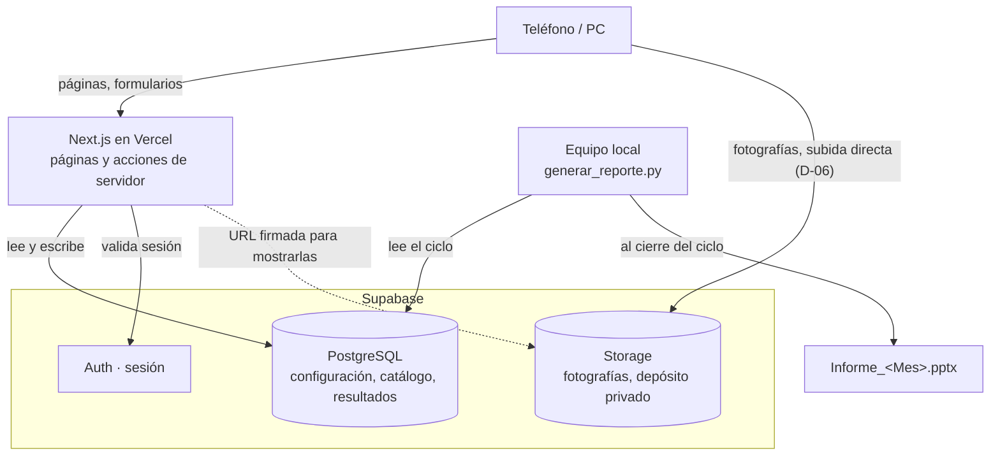

# Captura SCI

Sistema de captura de evidencias para la revisión periódica mensual de sistemas contra incendio.

Área de Protección Contra Incendios · Volkswagen de México, Planta Guanajuato
Documento de referencia: **I1.15M2_4037-002 Rev. 5** — *Inspección, pruebas y mantenimiento de los
sistemas contra incendio*.

---

## Qué resuelve

La revisión mensual cubre 221 elementos repartidos en cinco sistemas. Hasta ahora, la evidencia de
campo llegaba por WhatsApp y alguien la clasificaba a mano, creando una carpeta por elemento y
arrastrando archivos con nombres como `WhatsApp Image 2026-03-21 at 19.46.14.jpeg`. Las descripciones
se capturaban aparte en un libro de Excel y los formatos RAG se llenaban en papel al cierre. Conocer
el avance exigía abrir las carpetas una por una.

Este sistema hace que la fotografía y la descripción entren **ya asociadas al elemento que se está
revisando**, que el avance sea consultable en cualquier momento, y que tanto el catálogo de elementos
como los puntos a supervisar se puedan modificar durante la ejecución sin intervención técnica.

## Qué hace

- **Captura en campo** desde teléfono: se elige el elemento, se toman las fotografías y se contestan
  los puntos de revisión. La clasificación es automática porque el elemento ya está seleccionado.
- **Recepción** de conjuntos de fotografías sin clasificar para asignarlas a su elemento, mientras la
  evidencia de los otros sistemas siga llegando por WhatsApp.
- **Seguimiento** del avance separado en los dos procesos que corren en paralelo: la captura propia y
  lo que se recibe de terceros.
- **Catálogo configurable**: los elementos y los puntos a supervisar se editan durante la ejecución
  y se importan y exportan en JSON.
- **Generación del informe** mensual en PowerPoint a partir de lo capturado.

## Cómo está armado



La captura y el seguimiento viven en la nube para poder usarse desde teléfono personal dentro de la
planta, sin depender de la red corporativa. Las fotografías van del navegador directo a Storage —
Next.js nunca las recibe, sólo registra la ruta resultante y firma URL de lectura corta para
mostrarlas (D-06). La generación del informe se ejecuta en el equipo local porque necesita la
plantilla corporativa, las fuentes institucionales y PowerPoint para verificar el resultado. El
porqué de cada pieza está en [`docs/decisiones.md`](docs/decisiones.md).

## Estructura del repositorio

```
captura-sci/
├── README.md
├── docs/                             documentación del proyecto
│   ├── requerimientos.md
│   ├── modelo-de-datos.md
│   ├── flujos-de-usuario.md
│   └── decisiones.md
├── web/                              aplicación Next.js
│   ├── app/
│   │   ├── login/                    fuera del grupo (app): sin sesión no se llega aquí
│   │   └── (app)/                    layout.tsx exige sesión; encabezado y cerrar sesión
│   │       ├── page.tsx              inicio: enlaces a Capturar y Recepción
│   │       ├── capturar/             Fase 2 — sistemas, lista por sistema, formulario
│   │       │   └── [sistema]/[id]/   Formulario.tsx (cliente) + actions.ts (servidor)
│   │       ├── recepcion/            Fase 3 — Recepcion.tsx (cliente) + actions.ts (servidor)
│   │       └── tablero/              Fase 4 — Tablero.tsx: avance, ritmo, tabla y exportación
│   ├── components/EstadoBadge.tsx
│   └── lib/
│       ├── supabase/                 clientes de navegador, servidor y proxy
│       ├── tipos.ts                  formas compartidas, reflejan el diccionario de datos
│       ├── estado.ts                 calcularEstado() — única fuente de verdad, ver §4
│       ├── datos.ts                  consultas de servidor ("server-only")
│       ├── registros.ts              aseguraRegistro/recalcularYGuardarEstado, compartido
│       ├── imagen.ts                 reducción a 2560px/calidad 88 con orientación EXIF
│       └── rutas.ts, texto.ts        rutas de Storage; búsqueda sin acentos
├── supabase/
│   ├── migrations/                   0001 esquema · 0002 sistemas fijos · 0003 RLS · 0004 Storage
│   └── seed/                         catálogo y plantillas ya extraídos, por ciclo
└── scripts/                          utilerías en Python (requirements.txt)
    ├── extraer_rags.py               RAG en PDF → supabase/seed/{catalogo,plantillas}_<ciclo>.json
    ├── cargar_catalogo.py            ese JSON → Supabase (valida en seco sin --confirmar)
    └── generar_reporte.py            Supabase → informe mensual en PowerPoint (fase 6, aún no escrito)
```

El repositorio vive **fuera** de la carpeta sincronizada de Google Drive. En la carpeta de trabajo se
depositan sólo los productos operativos: catálogo exportado, resultados exportados e informe
generado.

## Documentación

| Documento | Contenido |
|---|---|
| [`docs/requerimientos.md`](docs/requerimientos.md) | Situación actual, alcance del piloto, requerimientos numerados y lo que queda fuera |
| [`docs/modelo-de-datos.md`](docs/modelo-de-datos.md) | Diccionario de datos, estructuras JSON, derivación del estado, almacenamiento y control de acceso |
| [`docs/flujos-de-usuario.md`](docs/flujos-de-usuario.md) | Recorridos completos: apertura de ciclo, captura, recepción, seguimiento, cambios de catálogo y cierre |
| [`docs/decisiones.md`](docs/decisiones.md) | Decisiones de negocio y técnicas con su contexto y sus consecuencias |

Quien se incorpore al proyecto debería leer, en orden: requerimientos, flujos y modelo de datos.

## Requisitos

| Herramienta | Versión |
|---|---|
| Node.js | 20 o superior |
| Python | 3.11 o superior |
| Cuenta de Supabase | Plan gratuito |
| Cuenta de Vercel | Plan gratuito |

Dependencias de Python para las utilerías, fijadas en [`scripts/requirements.txt`](scripts/requirements.txt):
`pypdf`, `Pillow`, `python-pptx`, `supabase`, `python-dotenv`.

## Arranque local

```bash
# 1. Dependencias de la aplicación
cd web
npm install

# 2. Variables de entorno (las usan tanto la app como las utilerías de Python)
cp .env.example .env.local
#    y capturar los valores del proyecto de Supabase: URL, llave pública
#    y llave de servicio (Project Settings → API)
cd ..

# 3. Dependencias de Python
python -m pip install -r scripts/requirements.txt

# 4. Base de datos: aplicar el esquema
npx --prefix web supabase link --project-ref <referencia-del-proyecto>
npx --prefix web supabase db push

# 5. Catálogo del ciclo: extraer de los RAG y cargar a Supabase
python scripts/extraer_rags.py --formatos "<ruta a Formatos de soporte>" --ciclo 2026-08
python scripts/cargar_catalogo.py --ciclo 2026-08        # valida y resume; nada se escribe todavía
python scripts/cargar_catalogo.py --ciclo 2026-08 --confirmar

# 6. Servidor de desarrollo
cd web && npm run dev
```

La aplicación queda en `http://localhost:3000`. La extracción es una propuesta, no la versión
final —el script señala en pantalla y en el campo `notas` de cada elemento los renglones ambiguos
de los RAG de origen (duplicados, huecos en la numeración)— así que conviene revisar su salida
antes de correr `cargar_catalogo.py --confirmar`.

## Variables de entorno

| Variable | Dónde se usa | Descripción |
|---|---|---|
| `NEXT_PUBLIC_SUPABASE_URL` | Navegador y servidor | Dirección del proyecto de Supabase |
| `NEXT_PUBLIC_SUPABASE_ANON_KEY` | Navegador y servidor | Llave pública; opera bajo las políticas de seguridad por renglón |
| `SUPABASE_SERVICE_ROLE_KEY` | Sólo utilerías locales | Llave privilegiada para la carga inicial y el generador de informe. **No se publica ni se incluye en la aplicación** |

Las dos primeras se configuran también en Vercel. La tercera se queda en el equipo local, en un
archivo `.env` que no se versiona.

## Comandos

| Comando | Qué hace |
|---|---|
| `npm run dev` | Servidor de desarrollo (dentro de `web/`) |
| `npm run build` | Compilación de producción |
| `npm run lint` | Revisión de estilo (`eslint .`; `next lint` ya no existe desde Next 16) |
| `npx supabase db push` | Aplica las migraciones pendientes (dentro de `web/`, con el proyecto enlazado) |
| `python scripts/extraer_rags.py --formatos <carpeta> --ciclo <AAAA-MM>` | RAG en PDF → catálogo y plantillas en JSON |
| `python scripts/cargar_catalogo.py --ciclo <AAAA-MM> [--confirmar]` | Ese JSON → Supabase. Sin `--confirmar` sólo valida |
| `python scripts/generar_reporte.py --ciclo 2026-08` | Arma el informe mensual en PowerPoint (fase 6, aún no escrito) |

## Despliegue

El despliegue es automático: cada envío a la rama principal publica en Vercel. Las migraciones de
base de datos se aplican por separado con `npx supabase db push` antes de publicar cambios que
dependan de ellas.

## Estado del proyecto

| Fase | Entregable | Estado |
|---|---|---|
| 0 | Documentación y estructura del repositorio | Terminada |
| 1 | Base de datos, seguridad, sesión y carga inicial del catálogo | Proyecto enlazado y credenciales en `web/.env.local`; falta aplicar el esquema |
| 2 | Captura desde teléfono con formulario configurable | Código listo; falta probarlo en un teléfono real |
| 3 | Recepción y clasificación de evidencia externa | Código listo; falta probarlo con fotos reales |
| 4 | Tablero de seguimiento | Código listo; falta probarlo con datos reales |
| 5 | Editor de catálogo y de plantillas | Pendiente |
| 6 | Generador del informe mensual | Pendiente |
| 7 | Archivado del ciclo y liberación del depósito | Pendiente |

Dentro de la fase 1: las migraciones, la aplicación Next.js con inicio/cierre de sesión, y los dos
scripts de catálogo están escritos y probados por separado —`npm run build`, `eslint .` y el
extractor corrieron limpio contra los PDF reales de agosto (221 elementos, cero duplicados)—. El
proyecto de Supabase (`captura-revision-periodica-sci`) ya está enlazado y `web/.env.local` tiene sus
tres credenciales; una verificación de sólo lectura contra la API confirmó que **el esquema todavía
no se aplicó** (ninguna de las siete tablas existe todavía). Faltan `npx supabase db push` y
`cargar_catalogo.py --confirmar` para terminar la fase.

Dentro de la fase 2: `/capturar` (sistemas), `/capturar/[sistema]` (lista con búsqueda y estado) y
`/capturar/[sistema]/[id]` (formulario generado desde la plantilla, con fotografías, borrador local
y "guardar y siguiente") compilan y pasan `tsc`/`eslint` limpio — cubre RF-01 a RF-09. Lo que el
build no puede probar por sí solo: que la subida directa a Storage y la sesión funcionen de verdad
desde un teléfono, en la red de la planta, con la señal intermitente que describe RNF-03. Eso exige
la fase 1 completa (proyecto real) más una prueba de campo.

Dentro de la fase 3: `/recepcion` cubre RF-10 a RF-15 — arrastrar o elegir un lote de fotografías,
reducirlas igual que en captura directa, la rejilla de pendientes con selección múltiple, asignar a
sistema, elemento y momento (mueve el objeto en Storage con la operación nativa, no descarga y
vuelve a subir), descartar sin borrar el objeto, y abrir el formulario del elemento para el texto
que acompaña. El formulario de `/capturar/[sistema]/[id]` ahora se abre desde los dos caminos: su
guarda pasó de exigir que el sistema esté en `captura_directa` a exigir sólo que esté en
`sistemas_activos`, y "guardar y siguiente" distingue el origen para no ofrecer un recorrido
ordenado que sólo tiene sentido en captura directa. La lógica de asegurar el registro y recalcular
su estado, antes duplicada, quedó en `lib/registros.ts` porque ambas fases la necesitaban idéntica.

Dentro de la fase 4: `/tablero` cubre RF-16 a RF-20 con los datos ya cargados en Supabase, sin
tocar ninguna tabla nueva. "Mi captura" muestra total, completados, pendientes y porcentaje de
avance por sistema de captura directa, con acceso directo al siguiente elemento pendiente, y un
ritmo necesario (pendientes entre días hasta `config.fechas.ejecucion_fin`) que se agregó al valor
por defecto del ciclo porque el modelo de datos ya lo documentaba pero `cargar_catalogo.py` nunca lo
escribía. "Recepción" muestra avance por responsable —completados, pendientes, días sin reportar
evidencia— y cuántas fotografías siguen sin clasificar en `/recepcion`. Debajo, una tabla con los
221 elementos filtrable por sistema, responsable y estado, con fotografías por momento, quién
capturó y cuándo; cualquier renglón abre el elemento en `/capturar`. Exporta la tabla ya filtrada a
CSV (con BOM, para que Excel no maltrate los acentos) y los 221 resultados completos a JSON, ambos
generados en el navegador a partir de lo que ya se cargó para pintar la pantalla.

**Ciclo piloto:** agosto 2026. Se libera para los dos sistemas internos —54 botones avisadores y 71
hidrantes interiores— y da seguimiento a los tres restantes mediante recepción. Los criterios con los
que se evaluará están en [`docs/requerimientos.md`](docs/requerimientos.md#9-criterios-de-aceptación-del-piloto).
