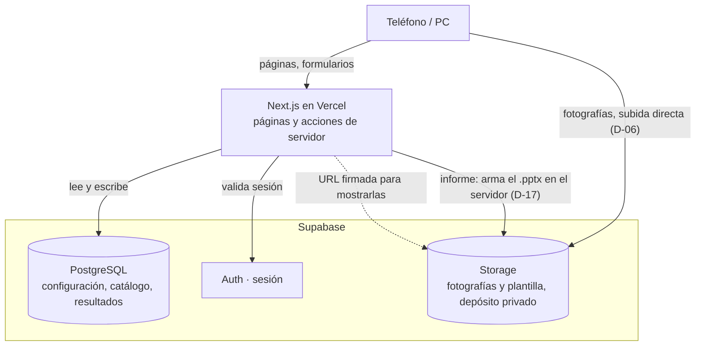

# Captura SCI

Sistema de captura de evidencias para la revisión periódica mensual de sistemas contra incendio.

Área de Protección Contra Incendios · Volkswagen de México, Planta Guanajuato
Documento de referencia: **I1.15M2_4037-002 Rev. 5** — *Inspección, pruebas y mantenimiento de los
sistemas contra incendio*.

---

## Qué resuelve

La revisión mensual cubre 221 elementos repartidos en cinco sistemas. Hasta ahora, la evidencia de
campo llegaba por WhatsApp y alguien la clasificaba a mano, creando una carpeta por elemento y
arrastrando archivos con nombres como `WhatsApp Image 2026-03-21 at 19.46.14.jpeg`. Las descripciones
se capturaban aparte en un libro de Excel y los formatos RAG se llenaban en papel al cierre. Conocer
el avance exigía abrir las carpetas una por una.

Este sistema hace que la fotografía y la descripción entren **ya asociadas al elemento que se está
revisando**, que el avance sea consultable en cualquier momento, y que tanto el catálogo de elementos
como los puntos a supervisar se puedan modificar durante la ejecución sin intervención técnica.

## Qué hace

- **Captura en campo** desde teléfono: se elige el elemento, se toman las fotografías y se contestan
  los puntos de revisión. La clasificación es automática porque el elemento ya está seleccionado.
- **Recepción** de conjuntos de fotografías sin clasificar para asignarlas a su elemento, mientras la
  evidencia de los otros sistemas siga llegando por WhatsApp.
- **Seguimiento** del avance separado en los dos procesos que corren en paralelo: la captura propia y
  lo que se recibe de terceros.
- **Catálogo configurable**: elementos, plantillas, zonas, sistemas y el ciclo mismo se editan desde
  la aplicación durante la ejecución, sin Python ni SQL; se importan y exportan en JSON.
- **Generación del informe** fotográfico mensual en PowerPoint, con un botón desde la propia
  aplicación, a partir de lo capturado.

## Cómo está armado



La captura, el seguimiento y la generación del informe viven todos en la nube, para poder usarse
desde teléfono personal dentro de la planta sin depender de la red corporativa. Las fotografías van
del navegador directo a Storage — Next.js nunca las recibe, sólo registra la ruta resultante y firma
URL de lectura corta para mostrarlas (D-06). El informe se arma también en el servidor: descarga la
plantilla corporativa y las fotografías necesarias desde Storage, arma el `.pptx` con `pptx-automizer`
y `sharp`, lo deja guardado en el depósito y ofrece una URL firmada para bajarlo — la revisión final
sigue siendo abrirlo en PowerPoint, sólo que ya no hace falta estar frente al equipo que lo generó
(D-04, revisada en D-17). El porqué de cada pieza está en [`docs/decisiones.md`](docs/decisiones.md).

## Estructura del repositorio

```
captura-sci/
├── README.md
├── docs/                             documentación del proyecto
│   ├── requerimientos.md
│   ├── modelo-de-datos.md
│   ├── flujos-de-usuario.md
│   └── decisiones.md
├── web/                              aplicación Next.js
│   ├── app/
│   │   ├── login/                    fuera del grupo (app): sin sesión no se llega aquí
│   │   └── (app)/                    layout.tsx exige sesión; encabezado con NavBar.tsx
│   │       ├── page.tsx, Tablero.tsx El inicio es el tablero (D-21) — avance, ritmo, tabla, exportación
│   │       ├── capturar/             Fase 2 — sistemas, lista por sistema, formulario
│   │       │   └── [sistema]/[id]/   Formulario.tsx (cliente) + actions.ts (servidor)
│   │       ├── recepcion/            Fase 3 — Recepcion.tsx (cliente) + actions.ts (servidor)
│   │       ├── sistemas/[clave]/     Fase 5 + RAG fusionados (D-21): elementos, plantilla, formato y documento RAG
│   │       ├── configuracion/        Ciclo · Sistemas · Zonas · Importar y exportar, en pestañas (D-21)
│   │       ├── rag/                  RagHub.tsx (D-22): "Ver e imprimir" (todo formato) y "Construir tipo nuevo"
│   │       │   └── [formato]/        RAG con sistema → redirige a /sistemas/[clave]; checklist se resuelve aquí
│   │       ├── informe/              Fase 6 (D-17) — botón, genera el .pptx en el servidor
│   │       ├── catalogo/,            Redirigen a /sistemas/[clave] o /configuracion — no hay pantalla aquí
│   │       │   tablero/              tablero/ redirige a /
│   ├── components/                   Aviso, Boton, Campo, PanelConfirmacion, BuscadorLista, SinCiclo,
│   │                                 NavBar, EstadoBadge, VisorDocumento (D-22) — antes copiados a mano (D-21)
│   └── lib/
│       ├── supabase/                 clientes de navegador, servidor y proxy
│       ├── tipos.ts                  formas compartidas, reflejan el diccionario de datos
│       ├── estado.ts                 calcularEstado() — única fuente de verdad, ver §4
│       ├── datos.ts                  consultas de servidor ("server-only")
│       ├── registros.ts              aseguraRegistro/recalcularYGuardarEstado, compartido
│       ├── imagen.ts                 reducción a 2560px/calidad 88 con orientación EXIF
│       ├── descargas.ts              descargar() — genera y dispara un archivo en el navegador
│       ├── rutas.ts, texto.ts        rutas de Storage; búsqueda sin acentos
│       ├── orden.ts                  criterio único de recorrido — zona, ubicación, anclaje (D-20)
│       ├── documentos/               constantes.ts + estilos-base.ts — identidad y CSS que RAG y checklist comparten (D-22)
│       ├── rag/                      documento.ts + render.ts + columnas.ts + estilos.ts — puros, sin Next/Supabase/React
│       │                             (ver docs/decisiones.md D-16: pensados para una segunda entrada local)
│       ├── checklist/                mismo patrón que rag/, para el tipo "checklist" (D-22) — no extiende DocumentoRAG
│       └── informe/                  collage.ts (sharp) + geometria.ts + generador.ts (pptx-automizer)
├── supabase/
│   ├── migrations/                   0001 esquema · 0002 sistemas fijos · 0003 RLS · 0004 Storage · 0005-0007 RAG y
│   │                                 catálogos compartidos · 0008 checklist (D-22)
│   └── seed/                         catálogo, plantillas y formatos ya extraídos, por ciclo
└── scripts/                          utilerías en Python (requirements.txt)
    ├── extraer_rags.py               RAG en PDF → supabase/seed/{catalogo,plantillas}_<ciclo>.json
    ├── extraer_checklist.py          Checklist en PDF → Excel de trabajo humano (D-22) — no lo lee la aplicación
    └── cargar_catalogo.py            ese JSON → Supabase (valida en seco sin --confirmar)
```

El repositorio vive **fuera** de la carpeta sincronizada de Google Drive. En la carpeta de trabajo se
depositan sólo los productos operativos: catálogo exportado, resultados exportados e informe
generado.

## Documentación

| Documento | Contenido |
|---|---|
| [`docs/requerimientos.md`](docs/requerimientos.md) | Situación actual, alcance del piloto, requerimientos numerados y lo que queda fuera |
| [`docs/modelo-de-datos.md`](docs/modelo-de-datos.md) | Diccionario de datos, estructuras JSON, derivación del estado, almacenamiento y control de acceso |
| [`docs/flujos-de-usuario.md`](docs/flujos-de-usuario.md) | Recorridos completos: apertura de ciclo, captura, recepción, seguimiento, cambios de catálogo y cierre |
| [`docs/decisiones.md`](docs/decisiones.md) | Decisiones de negocio y técnicas con su contexto y sus consecuencias |

Quien se incorpore al proyecto debería leer, en orden: requerimientos, flujos y modelo de datos.

## Requisitos

| Herramienta | Versión |
|---|---|
| Node.js | 20 o superior |
| Python | 3.11 o superior |
| Cuenta de Supabase | Plan gratuito |
| Cuenta de Vercel | Plan gratuito |

Dependencias de Python para las utilerías, fijadas en [`scripts/requirements.txt`](scripts/requirements.txt):
`pypdf`, `supabase`, `python-dotenv`, `openpyxl` (esta última sólo para `extraer_checklist.py`, que
escribe un Excel de trabajo — ver D-22). El informe fotográfico ya no es una utilería de Python — se
genera en el servidor (ver D-17); sus dependencias (`pptx-automizer`, `sharp`) están en
`web/package.json`, como el resto de la aplicación.

## Arranque local

```bash
# 1. Dependencias de la aplicación
cd web
npm install

# 2. Variables de entorno (las usan tanto la app como las utilerías de Python)
cp .env.example .env.local
#    y capturar los valores del proyecto de Supabase: URL, llave pública
#    y llave de servicio (Project Settings → API)
cd ..

# 3. Dependencias de Python
python -m pip install -r scripts/requirements.txt

# 4. Base de datos: aplicar el esquema
npx --prefix web supabase link --project-ref <referencia-del-proyecto>
npx --prefix web supabase db push

# 5. Formatos RAG: una sola vez, no depende de ningún ciclo (ver D-15)
cd web && npx tsx scripts/cargar-formatos.ts                 # valida y resume; nada se escribe todavía
npx tsx scripts/cargar-formatos.ts --confirmar

# 6. Plantilla del informe: una sola vez, no depende de ningún ciclo (ver D-17).
#    Primero se le agrega a la plantilla corporativa la diapositiva que sirve
#    de molde — pptx-automizer sólo sabe clonar diapositivas que ya existen.
cd ..
python scripts/preparar_plantilla_informe.py \
  --origen "<ruta a Reporte sistemas.pptx>" --destino "<ruta a Plantilla_Informe.pptx>"
cd web
npx tsx scripts/subir-plantilla-informe.ts --archivo "<ruta a Plantilla_Informe.pptx>"
npx tsx scripts/subir-plantilla-informe.ts --archivo "<ruta a Plantilla_Informe.pptx>" --confirmar
cd ..

# 7. Catálogo del ciclo: extraer de los RAG y cargar a Supabase
python scripts/extraer_rags.py --formatos "<ruta a Formatos de soporte>" --ciclo 2026-08
python scripts/cargar_catalogo.py --ciclo 2026-08        # valida y resume; nada se escribe todavía
python scripts/cargar_catalogo.py --ciclo 2026-08 --confirmar

# 8. Servidor de desarrollo
cd web && npm run dev
```

La aplicación queda en `http://localhost:3000`. La extracción es una propuesta, no la versión
final —el script señala en pantalla y en el campo `notas` de cada elemento los renglones ambiguos
de los RAG de origen (duplicados, huecos en la numeración)— así que conviene revisar su salida
antes de correr `cargar_catalogo.py --confirmar`.

## Variables de entorno

| Variable | Dónde se usa | Descripción |
|---|---|---|
| `NEXT_PUBLIC_SUPABASE_URL` | Navegador y servidor | Dirección del proyecto de Supabase |
| `NEXT_PUBLIC_SUPABASE_ANON_KEY` | Navegador y servidor | Llave pública; opera bajo las políticas de seguridad por renglón |
| `SUPABASE_SERVICE_ROLE_KEY` | Sólo utilerías locales | Llave privilegiada para la carga inicial del catálogo y de la plantilla del informe. **No se publica ni se incluye en la aplicación** — el informe en sí corre con la sesión normal del usuario, ver D-17 |

Las dos primeras se configuran también en Vercel. La tercera se queda en el equipo local, en un
archivo `.env` que no se versiona.

## Comandos

| Comando | Qué hace |
|---|---|
| `npm run dev` | Servidor de desarrollo (dentro de `web/`) |
| `npm run build` | Compilación de producción |
| `npm run lint` | Revisión de estilo (`eslint .`; `next lint` ya no existe desde Next 16) |
| `npx supabase db push` | Aplica las migraciones pendientes (dentro de `web/`, con el proyecto enlazado) |
| `npx tsx scripts/cargar-formatos.ts [--confirmar]` | (dentro de `web/`) `formatos_mensuales.json` → Supabase. Una sola vez, no por ciclo. Sin `--confirmar` sólo valida |
| `python scripts/preparar_plantilla_informe.py --origen <corporativa> --destino <plantilla>` | `Reporte sistemas.pptx` + la diapositiva molde de `Elemento` → `Plantilla_Informe.pptx` |
| `npx tsx scripts/subir-plantilla-informe.ts --archivo <ruta> [--confirmar]` | (dentro de `web/`) Sube `Plantilla_Informe.pptx` al depósito. Una sola vez, o cuando cambie. Sin `--confirmar` sólo valida |
| `python scripts/extraer_rags.py --formatos <carpeta> --ciclo <AAAA-MM>` | RAG en PDF → catálogo y plantillas en JSON |
| `python scripts/cargar_catalogo.py --ciclo <AAAA-MM> [--confirmar]` | Ese JSON → Supabase. Sin `--confirmar` sólo valida |
| `python scripts/extraer_checklist.py --pdf <ruta al PDF>` | Checklist en PDF → Excel de trabajo humano en `extracciones/` (D-22). El sistema no lo lee |
| `npx tsx web/scripts/verificar-checklist.ts` | Pureza y consistencia de `lib/checklist/*` — mismo patrón que `verificar-rag.ts` |

## Despliegue

El despliegue es automático: cada envío a la rama principal publica en Vercel. Las migraciones de
base de datos se aplican por separado con `npx supabase db push` antes de publicar cambios que
dependan de ellas.

## Estado del proyecto

| Fase | Entregable | Estado |
|---|---|---|
| 0 | Documentación y estructura del repositorio | Terminada |
| 1 | Base de datos, seguridad, sesión y carga inicial del catálogo | Terminada — esquema aplicado y catálogo cargado contra el proyecto real |
| 2 | Captura desde teléfono con formulario configurable | Código listo; falta probarlo en un teléfono real |
| 3 | Recepción y clasificación de evidencia externa | Código listo; falta probarlo con fotos reales |
| 4 | Tablero de seguimiento | Código listo; falta probarlo con datos reales |
| 5 | Editor de catálogo y de plantillas | Código listo; falta probarlo con datos reales |
| 6 | Generador del informe mensual | Rehecho contra el entregable real y verificado sobre el ciclo completo; falta abrirlo en PowerPoint |
| 7 | Archivado del ciclo y liberación del depósito | Pendiente |

Dentro de la fase 1: las migraciones, la aplicación Next.js con inicio/cierre de sesión, y los dos
scripts de catálogo están escritos y probados por separado —`npm run build`, `eslint .` y el
extractor corrieron limpio contra los PDF reales de agosto (221 elementos, cero duplicados)—. El
proyecto de Supabase (`captura-revision-periodica-sci`) ya está enlazado y `web/.env.local` tiene sus
tres credenciales; una verificación de sólo lectura contra la API confirmó que **el esquema todavía
no se aplicó** (ninguna de las siete tablas existe todavía). Faltan `npx supabase db push` y
`cargar_catalogo.py --confirmar` para terminar la fase.

Dentro de la fase 2: `/capturar` (sistemas), `/capturar/[sistema]` (lista con búsqueda y estado) y
`/capturar/[sistema]/[id]` (formulario generado desde la plantilla, con fotografías, borrador local
y "guardar y siguiente") compilan y pasan `tsc`/`eslint` limpio — cubre RF-01 a RF-09. Lo que el
build no puede probar por sí solo: que la subida directa a Storage y la sesión funcionen de verdad
desde un teléfono, en la red de la planta, con la señal intermitente que describe RNF-03. Eso exige
la fase 1 completa (proyecto real) más una prueba de campo.

Dentro de la fase 3: `/recepcion` cubre RF-10 a RF-15 — arrastrar o elegir un lote de fotografías,
reducirlas igual que en captura directa, la rejilla de pendientes con selección múltiple, asignar a
sistema, elemento y momento (mueve el objeto en Storage con la operación nativa, no descarga y
vuelve a subir), descartar sin borrar el objeto, y abrir el formulario del elemento para el texto
que acompaña. El formulario de `/capturar/[sistema]/[id]` ahora se abre desde los dos caminos: su
guarda pasó de exigir que el sistema esté en `captura_directa` a exigir sólo que esté en
`sistemas_activos`, y "guardar y siguiente" distingue el origen para no ofrecer un recorrido
ordenado que sólo tiene sentido en captura directa. La lógica de asegurar el registro y recalcular
su estado, antes duplicada, quedó en `lib/registros.ts` porque ambas fases la necesitaban idéntica.

Dentro de la fase 4: `/tablero` cubre RF-16 a RF-20 con los datos ya cargados en Supabase, sin
tocar ninguna tabla nueva. "Mi captura" muestra total, completados, pendientes y porcentaje de
avance por sistema de captura directa, con acceso directo al siguiente elemento pendiente, y un
ritmo necesario (pendientes entre días hasta `config.fechas.ejecucion_fin`) que se agregó al valor
por defecto del ciclo porque el modelo de datos ya lo documentaba pero `cargar_catalogo.py` nunca lo
escribía. "Recepción" muestra avance por responsable —completados, pendientes, días sin reportar
evidencia— y cuántas fotografías siguen sin clasificar en `/recepcion`. Debajo, una tabla con los
221 elementos filtrable por sistema, responsable y estado, con fotografías por momento, quién
capturó y cuándo; cualquier renglón abre el elemento en `/capturar`. Exporta la tabla ya filtrada a
CSV (con BOM, para que Excel no maltrate los acentos) y los 221 resultados completos a JSON, ambos
generados en el navegador a partir de lo que ya se cargó para pintar la pantalla.

Dentro de la fase 5: `/catalogo` cubre RF-21 a RF-26. Por sistema, `PlantillaEditor` edita bloques
de fotos, puntos de revisión (con su tipo, obligatoriedad y opciones si son de selección) y los
textos de descripción habilitados; reordenar es con flechas, no arrastrar. El identificador de un
punto o bloque ya existente no se puede editar —lo demás sí— porque es la llave que ata las
respuestas ya capturadas (`registros.valores`) y las fotografías (`fotos.momento`) a ese punto;
tocarlo las dejaría huérfanas. Guardar siempre pasa primero por una vista previa que recalcula el
estado de cada elemento activo del sistema contra la plantilla nueva y dice cuántos cambiarían —RF-26—
antes de escribir nada. `ElementosCatalogo` da de alta, edita y da de baja elementos sin salir de la
pantalla; si la edición cambia el código, mueve cada fotografía ya subida a la ruta con el código
nuevo antes de guardar el cambio, así que ninguna fotografía se pierde ni hay que volver a subirla.
Dar de baja nunca borra: el elemento sale de las listas de captura pero se puede reactivar. Desde
`/catalogo` se exporta el catálogo completo y las plantillas completas a JSON, y se importa un
catálogo editado fuera —con una vista previa de altas, actualizaciones y bajas por sistema antes de
confirmar, igual que el cambio de plantilla—; la conciliación sólo toca los sistemas presentes en el
archivo (ver D-14).

**Formatos RAG estandarizados** (fuera de la numeración de fases: es la revisión que D-12 dejó
prevista para "una vez estandarizados los formatos", ejecutada dentro de este mismo ciclo). `/rag`
cubre los cinco RAG mensuales con una sola estructura de documento — ver D-15 y D-16 para el porqué de
cada pieza. Lo que debe ser idéntico en los cinco (clasificación, razón social, domicilio, instrucción
general, bloque de cierre) vive en código, en `lib/rag/constantes.ts`, no en la base — así no hay
manera de que un formato lo traiga distinto. `lib/rag/{documento,render,estilos}.ts` es una función
pura de datos a HTML, verificada importándola desde un script de Node suelto sin Next ni Supabase;
`/rag/[formato]` la usa para ver, alternar entre formato vacío y con lo capturado, imprimir (en un
iframe oculto) y editar lo particular del formato (`FormatoEditor.tsx` — nombre, periodicidad,
sistema, documento de referencia, revisión, instrucciones propias; nunca `clave` ni los campos
globales). No hay descarga directa de archivo: "Guardar como PDF" lo da el diálogo de impresión del
propio navegador — generar el PDF en servidor (Chromium sin cabeza) se evaluó y se descartó por el
peso de la dependencia, ver D-16. La migración `0005_rag.sql` agrega la tabla `formatos` y tres
columnas a `elementos` (`referencia`, `seccion`, `orden_seccion`) que el área todavía tiene que llenar
— el script extractor las deja explícitamente en `None`/`null`, no las inventa. `formatos_mensuales.json`
se carga con `web/scripts/cargar-formatos.ts` (TypeScript, no Python: `formatos` no depende de ningún
ciclo, así que mezclarlo con `cargar_catalogo.py` habría confundido esa distinción) o desde el botón
"Cargar formatos" en `/rag`; cualquiera de los dos se corre una sola vez, no por ciclo. La segunda
entrada (un generador local para cuando D-10 lo exija) queda diseñada pero sin escribir.

Dentro de la fase 6 (D-17): `/informe` genera el informe fotográfico mensual con un botón, corriendo
en el servidor con la sesión normal del usuario — no un script local, como se planeó al principio de
la fase, sino lo que se pidió al retomarla. El documento reproduce el entregable que el área ya
producía: las diapositivas base de la plantilla (intro, portada y agenda) y, por cada sistema, su
divisor de capítulo seguido de **una diapositiva por elemento activo**, esté completo o no. Sobre
`Plantilla_Informe.pptx` — `Reporte sistemas.pptx` más una diapositiva que sirve de molde, generada
con `scripts/preparar_plantilla_informe.py` y subida al depósito, no versionada en el repositorio.

Cada diapositiva lleva el collage a la derecha y, en la columna izquierda, tres bloques en
posiciones **fijas** —para que todas se vean iguales aunque su contenido varíe— cada uno con su
subtítulo en el estilo de la plantilla: **Tabla de características** (los puntos de revisión, justo
debajo del título del elemento), **Observaciones** (los tres textos de campo, que se encogen si son
largos en vez de desbordarse) y **Datos del sistema**, anclado a la parte inferior sin salirse del
margen. Ese último bloque siempre trae los mismos siete renglones —sistema, zona, tipo, ubicación,
referencia, responsable y estado, con una raya donde falte el dato— que es lo que permite anclarlo
abajo con altura conocida. La respuesta de cada punto se pinta como color de texto, igual que el
documento RAG, para que el mismo dato se vea igual en los dos entregables. Todo el texto va claro:
el layout hereda fondo Deep Space Blue del master.

La diapositiva molde de la plantilla se genera **sin placeholders**: al crear una diapositiva desde
un layout, python-pptx copia sus placeholders con el texto de ejemplo dentro ("Título en Deep Space
Blue", "Click para editar el texto"), que no es una guía sino contenido real y salía impreso debajo
de lo que dibuja el generador.

El grupo y el KSU que firman el informe (`GRUPO`, `KSU` en `lib/informe/geometria.ts`) no salen de la
base: son del área que entrega, y la plantilla corporativa los trae sin llenar (`KSU XXX`). Se
resuelven al generar, junto con la fecha y el ciclo de la portada y de los pies.

Desde `/informe` se puede generar el ciclo completo o sólo el capítulo de uno o varios sistemas —una
casilla por sistema, todas marcadas por defecto—, para cuando sólo hace falta reimprimir uno sin
regenerar los demás. `generarInformePptx(supabase, ciclo, sistemasClaves?)` filtra qué sistemas
entran; el nombre del archivo lleva un sufijo con las claves cuando es parcial, para que no se
confunda con el ciclo completo.

**La agenda y los divisores de capítulo se arman en cada corrida, para de 2 a
`geo.AGENDA_MAX_SISTEMAS` (10) sistemas — no para cinco fijos.** El divisor usa un solo molde
(`geo.SLIDE_MOLDE_DIVISOR`, clonado una vez por sistema con elementos, numerado en el orden en que
aparece); la agenda llena las 10 casillas número+nombre que
`scripts/preparar_plantilla_informe.py` amplió a partir de las 5 originales de la plantilla
corporativa —duplicando su XML tal cual, no redibujándolas, para que el círculo, el color y la
tipografía salgan idénticos— y deja vacías las que sobren. Un informe con más de 10 sistemas
seleccionados falla con un mensaje claro en vez de generar una agenda incompleta. Ver la revisión
"Cuarta pasada" de D-17.

Verificado contra el ciclo real de agosto (seis sistemas activos, incluido `central_avisos` con
`rag = "RAG 2.19"`, 445 fotografías): el informe completo sale con la portada, la agenda (6 nombres,
4 casillas vacías) y los seis divisores en su título correcto y su número secuencial; un informe
parcial de dos sistemas sale con sólo sus dos divisores y sus elementos, agenda y numeración
coherentes con la selección. Todo el texto va claro sobre el fondo, sin bloques encimados —el último
termina justo en el margen. Este generador se había dado por bueno antes sin abrirlo nunca en
PowerPoint, y escondía defectos que ninguna comprobación automática podía ver —un texto invisible, un
divisor mal etiquetado, y luego una agenda que se generaba "sin error" con las diez casillas en
blanco por una corrida de texto vaciada de más—; el detalle completo está en la revisión de D-17.
**Pendiente: abrir el archivo en PowerPoint** y confirmar el resultado visual con las fuentes
institucionales instaladas — es el paso que faltó la primera vez.

**Catálogos compartidos y columnas del RAG** (fuera de la numeración de fases, terminada). Se
detectó que `elementos.zona` y `elementos.seccion` eran el mismo dato tecleado dos veces, y que
`elementos.tipo` era texto libre que ningún documento imprimía pese a tener valores reales ("Gabinete"
/"Pie", "Mariposa"/"Vástago"). `zonas` (nuevo, migración `0007_catalogos.sql`) es el catálogo único de
la planta —no cuelga del ciclo ni del sistema, para co-ubicar elementos de sistemas distintos— y
sustituye a `orden_seccion`; `sistemas.tipos` es un diccionario `{clave, nombre}` por sistema, mismo
criterio que `plantillas.puntos` (D-02). `web/lib/rag/columnas.ts` es ahora la única fuente de qué
columnas lleva el documento: antes esa lista vivía repetida a mano en cinco lugares de `render.ts`,
y el desajuste entre esos conteos ya había causado el defecto que D-15 documenta — con columnas
condicionales (Ubicación/Referencia por formato, según `formatos.columnas`; Tipo sólo si el sistema
trae diccionario) ese riesgo era real de reintroducir. `web/scripts/verificar-rag.ts` comprueba, para
varios documentos de prueba, que `columnasDe().length` y todos los conteos de columnas del HTML
coinciden. `web/lib/orden.ts` reemplaza a `elementos.orden` como criterio de recorrido: zona → ubicación
(alfabético natural) → nombre, con `elementos.orden_anclado` como excepción manual — la misma función
la usan el documento RAG y el informe fotográfico. El detalle completo está en D-18, D-19 y D-20.

Durante esta migración se encontró y se corrigió un problema real: `scripts/cargar_catalogo.py`
sobrescribía sin avisar cualquier corrección hecha directo en la base (`seccion` de 89 elementos vivía
sólo ahí, no en el JSON versionado) — el script ya lleva una advertencia explícita al respecto (ver
D-18). Los 175 elementos que quedaron sin zona (esos 89 más 91 que nunca la tuvieron) se recuperaron
con el área en un Excel de una sola vez, no un flujo repetible — al llenarlo salieron cinco zonas más
finas para botones avisadores (antes tres, inferidas del PDF) y un ajuste de nombre. Los 221 elementos
activos del ciclo ya tienen `zona_id` — ver el detalle en D-18.

**Reorganización de pantallas** (fuera de la numeración de fases, terminada; D-21). Seis entradas sin
barra de navegación pasan a tres: el **inicio** (`/`) es ahora el tablero, en vez de un menú de seis
tarjetas iguales; **`/sistemas/[clave]`** fusiona lo que antes eran `/catalogo/[sistema]` y
`/rag/[formato]` —elementos, plantilla, formato y documento RAG de un mismo sistema, en una sola
pantalla, con enlace real entre ellos por primera vez—; **`/configuracion`** fusiona `/catalogo` y
`/rag` en pestañas (Ciclo, Sistemas, Zonas, Importar y exportar). Es la primera vez que `ciclos.config`
y `sistemas` se editan desde la aplicación en vez de por Python o el panel de Supabase — incluido
cerrar el ciclo, que tampoco tenía pantalla. Antes de mover nada se extrajeron a `web/components/`
los patrones que estaban copiados a mano en cada pantalla (`Aviso`, `PanelVistaPrevia`/`PanelExito`,
`SinCiclo`, `Campo`/`CampoTexto`/`CampoSelect`, `BuscadorLista`), y `ElementosCatalogo.tsx` se
reescribió de fondo: zona y tipo pasan de texto libre a seleccionarse de un catálogo, ya no se pueden
escribir valores que no existan. Las rutas viejas (`/catalogo`, `/catalogo/[sistema]`, `/tablero`)
redirigen a su lugar nuevo — `/rag` y `/rag/[formato]` también redirigían en su momento, pero D-22 las
reactivó (ver abajo). **Deliberadamente fuera de esta pasada:** abrir un ciclo nuevo (sigue siendo
`cargar_catalogo.py`) y mover el recorrido de captura (`/capturar`, "guardar y siguiente") al criterio
de `lib/orden.ts` — hoy sólo lo usan el documento RAG y el informe; el detalle está en D-21.

**Un segundo tipo de documento ("checklist"), y `/rag` vuelve a existir** (fuera de la numeración de
fases, terminada; D-22). El usuario compartió un formato que el sistema no soportaba: una lista de
verificación diaria de una unidad (ambulancia A-01, RAG 4.1), llenada a mano en papel, que no recorre
ningún catálogo de elementos ni pasa por el flujo de captura fotográfica — se imprime en blanco y
punto, en horizontal, con columnas repetidas por fecha (Fecha+Grupo en el encabezado, Nombre+Firma en
el pie de CADA columna, no un cierre único al final como en RAG). `formatos` gana `tipo_documento`
(`'rag' | 'checklist'`) y dos tablas nuevas, `checklist_bloques`/`checklist_items` (migración
`0008_checklist.sql`); `web/lib/checklist/` es un módulo hermano de `web/lib/rag/`, no una extensión de
`DocumentoRAG` — forzarlo ahí habría hecho mentir a `elementoId` y a `CierreFormato`. Lo que sí es
idéntico entre los dos motores (clasificación, razón social, domicilio, logo, paleta, mecánica
genérica de tabla) se factorizó a `web/lib/documentos/`; la CSS completa de RAG no se reescribió para
consumirla —tocar `render.ts`, ya en producción, sólo para des-duplicar CSS no valía el riesgo— así que
ahí queda una duplicación deliberada y acotada. `/rag` deja de redirigir: es la pestaña independiente
que se pidió, con "Ver e imprimir" (todo formato) y "Construir tipo nuevo" (marcador de posición hasta
la Etapa 3: el constructor sin código y el importador de JSON). `scripts/extraer_checklist.py` extrae
el PDF de origen a un Excel de trabajo humano —el sistema no lo lee— con el mismo principio de
`extraer_rags.py`: señala ambigüedades (Pos duplicados, huecos de numeración) en vez de resolverlas.
Verificado en vivo contra el proyecto real: `web/scripts/verificar-checklist.ts` (mismo patrón que
`verificar-rag.ts`) y un formato de prueba sembrado, visto en el navegador y luego retirado. El detalle
completo está en D-22.

**Ciclo piloto:** agosto 2026. Se libera para los dos sistemas internos —54 botones avisadores y 71
hidrantes interiores— y da seguimiento a los tres restantes mediante recepción. Los criterios con los
que se evaluará están en [`docs/requerimientos.md`](docs/requerimientos.md#9-criterios-de-aceptación-del-piloto).
