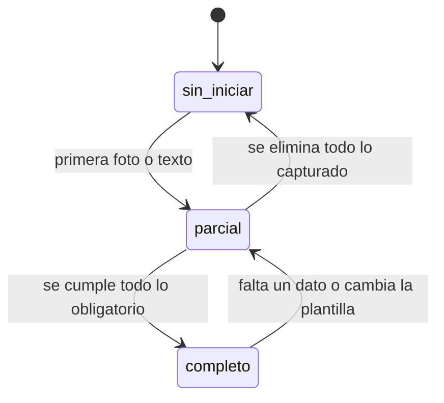

# Flujos de usuario

Recorridos completos del sistema de captura de evidencias, en el orden en que ocurren durante un
ciclo mensual de revisión.

---

## Actores

| Actor | Papel en el sistema |
|---|---|
| **Encargado de sistemas** | Abre y cierra el ciclo, mantiene el catálogo, captura los sistemas internos, clasifica lo que recibe de terceros y genera el informe. Único usuario del ciclo piloto |
| **Especialista de campo** | Ejecuta la revisión de red y exteriores. En el ciclo piloto no entra al sistema: envía su evidencia por WhatsApp |
| **Coordinación de turno** | Supervisa y firma los formatos. No opera el sistema; recibe el informe generado |

---

## Flujo 1 — Apertura del ciclo

Se ejecuta una vez, antes del primer día de ejecución.

1. El encargado corre `python scripts/cargar_catalogo.py --ciclo <AAAA-MM> --confirmar` desde su
   equipo. Todavía no hay pantalla para esto — abrir un ciclo clonando el anterior es una operación
   de una vez al mes, bastante más compleja que ajustar uno ya abierto (ver docs/decisiones.md D-21).
2. El script propone la clave `2026-08` y el nombre `Agosto 2026`, y cierra el ciclo anterior — a
   partir de ese momento sólo hay uno abierto.
3. Desde **Configuración → Ciclo**, el encargado ajusta nombre, fechas, qué sistemas quedan activos
   y cuáles se capturan directo.
4. Desde **Configuración → Sistemas** y **Configuración → Zonas**, da de alta lo que falte del
   catálogo compartido antes de tocar elementos.
5. Desde cada **sistema** (`/sistemas/[clave]`), ajusta el catálogo de elementos del mes (altas,
   bajas, reasignación de responsables) y revisa la plantilla de puntos de revisión.

**Resultado:** catálogo y plantillas listos; todos los elementos en estado `sin_iniciar`.

En el primer ciclo no hay de dónde clonar: el catálogo se carga importando el JSON que produce el
script de extracción de los formatos RAG, y se corrige desde `/sistemas/[clave]` o desde
**Configuración → Importar y exportar**.

---

## Flujo 2 — Captura en campo

El recorrido principal. Se ejecuta desde teléfono, parado frente al elemento.

1. El encargado abre la aplicación en el teléfono e inicia sesión. La sesión permanece abierta entre
   visitas, de modo que no hay que autenticarse en cada elemento.
2. Elige el sistema que va a recorrer. La aplicación muestra la lista de elementos del sistema en el
   orden de recorrido definido en el catálogo, cada uno con su distintivo de estado.
3. Busca el elemento por identificador, rótulo o ubicación, o lo elige de la lista.
4. Se abre el formulario, generado a partir de la plantilla del sistema:
   - Bloques fotográficos según la plantilla. En hidrantes interiores y botones avisadores son
     *Antes* y *Después*; en válvulas aéreas sería un único bloque *Estado actual*.
   - Los tres campos de descripción: cómo se encontró, qué se le realizó y pendientes.
   - Los puntos de revisión del sistema, con el control que corresponde a su tipo.
5. Toma las fotografías. Cada una se reduce en el teléfono antes de subirse y se envía directamente
   al depósito de archivos, sin pasar por el servidor de la aplicación. La miniatura aparece en el
   bloque conforme termina la subida.
6. Escribe las descripciones y contesta los puntos. Lo escrito se conserva como borrador en el
   navegador conforme se teclea.
7. Pulsa **Guardar y siguiente**.
   - El sistema calcula el estado del elemento contra la plantilla.
   - Si algo obligatorio falta, lo señala y ofrece guardar de todos modos como `parcial`.
   - Avanza al siguiente elemento pendiente del mismo sistema.

**Resultado:** elemento en estado `completo` o `parcial`, con sus fotografías clasificadas y su
autor y fecha registrados.

### Interrupciones previstas

| Situación | Comportamiento |
|---|---|
| Se pierde la señal a media captura | El borrador permanece en el navegador. Al recuperar señal se reintenta la subida de fotografías pendientes |
| El elemento no está en el catálogo | Desde la misma lista se da de alta y se continúa. Ver Flujo 5 |
| El elemento no se pudo revisar | Se guarda como `parcial` y se anota el motivo en pendientes |
| Se equivocó de elemento | Se abre el elemento correcto y se recapturan las fotografías; las mal asignadas se eliminan desde el formulario del elemento equivocado |

---

## Flujo 3 — Recepción de evidencia enviada por terceros

Para los tres sistemas que ejecutan los especialistas de campo y que siguen llegando por WhatsApp.

1. El encargado exporta del grupo de WhatsApp las fotografías del día a una carpeta de su equipo.
2. Entra a **Recepción** y arrastra el conjunto completo. Los archivos suben al área de espera
   conservando su nombre original.
3. La rejilla muestra las fotografías pendientes de clasificar, con vista previa y nombre de origen.
4. Selecciona una o varias que correspondan al mismo elemento y al mismo momento.
5. Elige sistema, elemento y momento, y confirma la asignación.
   - Las fotografías se mueven a la ruta definitiva del elemento y se renombran.
   - Salen de la rejilla de pendientes.
   - La confirmación lleva directo al formulario de ese elemento — no hace falta un paso aparte
     para abrirlo.
6. Captura ahí las descripciones y los puntos de revisión que el especialista reportó por mensaje.
7. Repite hasta vaciar la rejilla. Lo que quede visible es, por definición, lo que falta por
   clasificar.

Las fotografías que no corresponden a ningún elemento —capturas de pantalla, fotos repetidas, envíos
ajenos a la revisión— se descartan y dejan de aparecer sin borrarse del depósito.

**Resultado:** evidencia de terceros clasificada por elemento, con el mismo modelo de datos que la
capturada directamente. Su origen queda marcado como `recepcion`.

---

## Flujo 4 — Consulta del avance

Se ejecuta en cualquier momento, sin coordinar con nadie. Es lo que hoy exige abrir 221 carpetas.

El tablero separa los dos procesos que corren en paralelo:

**Mi captura** — los sistemas que se capturan directo.

- Total, capturados, pendientes y porcentaje de avance por sistema.
- Ritmo necesario para terminar dentro de la ventana de ejecución.
- Acceso directo al siguiente elemento pendiente.

**Recepción** — los sistemas que llegan por terceros.

- Avance por responsable: cuántos de sus elementos llegaron, cuántos faltan.
- Cuánto tiempo lleva cada responsable sin enviar evidencia.
- Fotografías en el área de espera sin clasificar.

Debajo, una tabla filtrable por sistema, responsable y estado, con identificador, rótulo, ubicación,
estado, número de fotografías por momento, quién capturó y cuándo. Desde cualquier renglón se abre el
elemento.

Exportaciones disponibles: la tabla a CSV y los resultados completos a JSON.

---

## Flujo 5 — Corrección del catálogo durante la ejecución

El catálogo cambia mientras se ejecuta. En agosto de 2026 hay cuatro casos identificados: el hidrante
del patio auxiliar de contenedores sin nomenclatura, el renglón duplicado `VC1-5` del RAG 2.8, la
existencia por confirmar de `HC2-4`, y los hidrantes `H-72`, `H-73` y `H-74` con evidencia previa
pero sin renglón en el RAG 2.3.

**Alta de un elemento**

1. Entrar al sistema (`/sistemas/[clave]`) y elegir *Agregar elemento*.
2. Capturar identificador único, rótulo, zona (del catálogo compartido), ubicación, tipo (del
   diccionario del sistema, si tiene uno) y responsable.
3. Guardar. El elemento aparece de inmediato en la lista de captura, en estado `sin_iniciar`.

**Modificación**

Cambiar ubicación, responsable u orden no altera lo capturado. Cambiar el identificador único obliga
a mover las fotografías; el sistema lo hace y avisa.

**Baja**

Un elemento no se borra: se marca inactivo. Desaparece de las listas de captura y de los conteos del
tablero, pero conserva lo capturado por si la baja se revierte.

**Importación masiva**

Para cambios extensos se exporta el catálogo desde **Configuración → Importar y exportar**, se edita
fuera y se vuelve a importar. La conciliación es por identificador dentro de cada sistema —el mismo
identificador puede repetirse entre sistemas distintos sin ambigüedad, ver docs/modelo-de-datos.md
§2.4—: lo existente se actualiza, lo nuevo se da de alta y lo que ya no aparece se marca inactivo.
Ningún caso borra evidencia.

---

## Flujo 6 — Cambio de los puntos de revisión

Los puntos que se supervisan cambian de un mes a otro, y a veces dentro del mismo mes.

1. Entrar al sistema (`/sistemas/[clave]`) y abrir su plantilla.
2. Agregar, quitar o reordenar puntos; cambiar su etiqueta, su tipo o su obligatoriedad. Lo mismo
   para los bloques fotográficos y los campos de descripción.
3. Al guardar, el sistema recalcula el estado de todos los elementos del sistema y **advierte cuántos
   cambian de estado antes de confirmar**.
4. Confirmado el cambio, el formulario de captura refleja los puntos nuevos de inmediato, sin
   intervención técnica.

Los valores capturados para un punto que se retira no se borran: dejan de mostrarse y de contar para
el estado, pero permanecen almacenados porque son información levantada en campo.

---

## Flujo 7 — Cierre del ciclo y generación del informe

1. El encargado verifica en el tablero que no queden elementos `parcial` ni fotografías sin
   clasificar.
2. Exporta los resultados a JSON y el detalle a CSV.
3. Entra a **Informe**. Por defecto salen marcados todos los sistemas activos del ciclo (de 2 a 10) —
   desmarca los que no hagan falta si sólo necesitas reimprimir el capítulo de uno en concreto, sin
   regenerar el ciclo completo. Pulsa *Generar informe*. La aplicación arma la presentación mensual
   sobre la plantilla corporativa: intro y portada fijas, y una agenda y unos divisores de capítulo que
   se arman en el momento según qué sistemas estén marcados —no una lista fija de cinco—, seguidos de
   una diapositiva por elemento —esté completo o parcial— con su collage fotográfico, sus
   observaciones, sus datos y sus puntos de revisión. Al terminar ofrece un enlace de descarga.
4. Descarga el archivo, lo revisa abriéndolo en PowerPoint y lo deposita a mano en la carpeta de
   trabajo junto con los formatos RAG llenados.
5. Entrega a coordinación de turno para supervisión y firma.
6. Desde **Configuración → Ciclo**, pulsa *Cerrar ciclo*. Queda disponible para consulta, pero ya no
   admite captura — no hay vuelta atrás desde la pantalla; reabrirlo exige tocar la base directamente.

El generador corre en el servidor, con la sesión normal del encargado — no hace falta estar frente al
equipo que lo genera. Lo que sigue siendo manual, y a propósito, es la revisión: el archivo se abre en
PowerPoint, con la plantilla corporativa y las fuentes institucionales instaladas, antes de
entregarlo (ver docs/decisiones.md D-17). Ese paso no es una formalidad: la primera versión del
generador se dio por buena sin abrirla nunca, y escribía todo el texto del mismo color que el fondo
—salía invisible— sin que ninguna comprobación automática lo notara.

---

## Estados de un elemento

| Estado | Significado |
|---|---|
| `sin_iniciar` | No se ha capturado nada |
| `parcial` | Hay evidencia, pero falta algo que la plantilla exige |
| `completo` | Están las fotografías requeridas, las descripciones y todos los puntos obligatorios |

El estado se calcula siempre contra la plantilla vigente. Por eso un elemento puede regresar de
`completo` a `parcial` sin que nadie lo toque: si la plantilla incorpora un punto obligatorio nuevo,
el dato falta de verdad.
