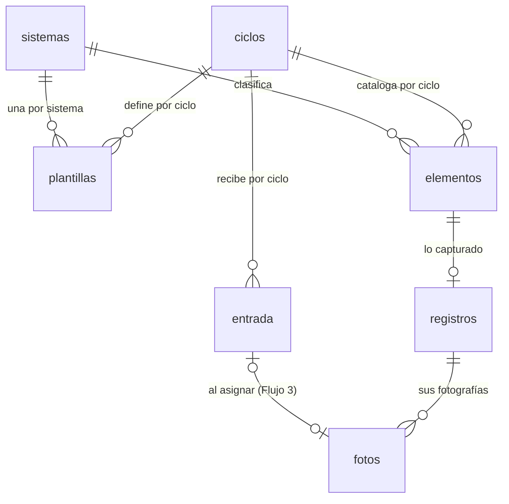

# Modelo de datos

Base de datos PostgreSQL alojada en Supabase. Las fotografías no se guardan en la base: viven en
Supabase Storage y la base conserva únicamente su ruta.

---

## 1. Panorama



Tres conjuntos con ciclos de vida distintos:

| Conjunto | Tablas | Quién lo modifica | Cuándo |
|---|---|---|---|
| **Configuración** | `ciclos`, `sistemas` | Encargado de sistemas | Al abrir el ciclo |
| **Catálogo** | `elementos`, `plantillas` | Encargado de sistemas | Al abrir el ciclo y durante la ejecución |
| **Resultados** | `registros`, `fotos`, `entrada` | Quien captura | Durante la ejecución |

Todo cuelga de `ciclos`. Un ciclo es un mes de revisión; cerrar uno y abrir el siguiente no toca los
datos del anterior.

---

## 2. Diccionario de datos

### 2.1 `ciclos`

Un renglón por mes de revisión.

| Campo | Tipo | Nulo | Descripción |
|---|---|---|---|
| `id` | uuid | no | Llave primaria |
| `clave` | text | no | Identificador legible, formato `AAAA-MM`. Único. Ejemplo: `2026-08` |
| `nombre` | text | no | Etiqueta de presentación. Ejemplo: `Agosto 2026` |
| `mes` | smallint | no | 1 a 12 |
| `anio` | smallint | no | Año de cuatro dígitos |
| `estado` | text | no | `abierto` o `cerrado`. Sólo un ciclo puede estar abierto |
| `config` | jsonb | no | Parámetros del ciclo. Ver §3.1 |
| `creado` | timestamptz | no | Alta del ciclo |
| `cerrado` | timestamptz | sí | Fecha de cierre; nulo mientras esté abierto |

### 2.2 `sistemas`

Catálogo fijo de los cinco sistemas contra incendio que cubre la revisión mensual.

| Campo | Tipo | Nulo | Descripción |
|---|---|---|---|
| `id` | uuid | no | Llave primaria |
| `clave` | text | no | Identificador técnico. Único. Ejemplo: `hidrantes_interiores` |
| `nombre` | text | no | Nombre operativo. Ejemplo: `Hidrantes interiores` |
| `rag` | text | sí | Formato asociado. Ejemplo: `RAG 2.3` |
| `orden` | smallint | no | Orden de presentación en la interfaz |
| `activo` | boolean | no | Permite ocultar un sistema sin borrarlo |

Valores iniciales:

| clave | nombre | rag | orden |
|---|---|---|---|
| `botones_avisadores` | Botones avisadores | RAG 2.4 | 1 |
| `hidrantes_interiores` | Hidrantes interiores | RAG 2.3 | 2 |
| `hidrantes_exteriores` | Hidrantes exteriores | RAG 2.2 | 3 |
| `valvulas_aereas` | Válvulas aéreas | RAG 2.7 | 4 |
| `valvulas_subterraneas` | Válvulas subterráneas | RAG 2.8 | 5 |

### 2.3 `plantillas`

Define **qué se supervisa** en un sistema durante un ciclo. Es la pieza que hace configurable el
formulario: cambia de un mes a otro sin tocar la aplicación.

| Campo | Tipo | Nulo | Descripción |
|---|---|---|---|
| `id` | uuid | no | Llave primaria |
| `ciclo_id` | uuid | no | Referencia a `ciclos` |
| `sistema_id` | uuid | no | Referencia a `sistemas` |
| `fotos` | jsonb | no | Momentos fotográficos requeridos. Ver §3.2 |
| `puntos` | jsonb | no | Puntos de revisión y su tipo de dato. Ver §3.2 |
| `texto_libre` | jsonb | no | Campos de descripción abierta habilitados |
| `actualizado` | timestamptz | no | Última modificación |

Restricción: única por `(ciclo_id, sistema_id)`.

### 2.4 `elementos`

Define **qué se revisa**. Es el catálogo del ciclo.

| Campo | Tipo | Nulo | Descripción |
|---|---|---|---|
| `id` | uuid | no | Llave primaria interna |
| `ciclo_id` | uuid | no | Referencia a `ciclos` |
| `sistema_id` | uuid | no | Referencia a `sistemas` |
| `codigo` | text | no | **Identificador único del elemento**, asignado por el área. Ejemplo: `AV-Z1-101` |
| `nombre` | text | no | Rótulo que lleva en campo. Ejemplo: `ELEM. 101` |
| `zona` | text | sí | Zona o nave. Ejemplo: `Zona 1 · Nave producción` |
| `ubicacion` | text | sí | Coordenada o referencia física. Ejemplo: `G 2 - 0.1 Planta alta` |
| `tipo` | text | sí | Tipo del dispositivo. Ejemplos: `HMS-D`, `MARIPOSA`, `VASTAGO`, `P`, `G` |
| `responsable` | text | sí | Persona asignada en el reparto del ciclo |
| `item_rag` | smallint | sí | Número de renglón en el formato RAG, para conciliar |
| `orden` | integer | no | Orden de recorrido dentro del sistema |
| `activo` | boolean | no | Falso retira el elemento del ciclo sin borrar lo capturado |
| `notas` | text | sí | Observaciones del catálogo, no de la revisión |

Restricción: `codigo` único por `(ciclo_id, sistema_id, codigo)` — dentro de su sistema, no en todo
el ciclo.

> **Por qué el identificador va separado del rótulo.** En los datos actuales el número rotulado no
> identifica al elemento: el RAG 2.4 repite `ELEM. 101` en las zonas 1, 2 y 3, y en las carpetas de
> marzo eso se resolvió agregando el nombre de quien revisó (`101 - Andres`, `101 - Jesus`,
> `101 - Julio`), lo que ata la identidad del activo a quién lo atendió ese mes. Con `codigo` propio
> el número deja de ser la llave y el rótulo puede repetirse sin ambigüedad.
>
> **Por qué la unicidad se limita al sistema.** Los formatos RAG reutilizan la misma nomenclatura
> para cosas distintas: `HC1-1` nombra un hidrante exterior en el RAG 2.2 y, por separado, la
> válvula de cierre de ese mismo hidrante en el RAG 2.8. Son dos elementos físicos distintos que
> coinciden en el nombre por convención de la propia instrucción, no un error de captura. Exigir
> unicidad en todo el ciclo rechazaría el segundo como duplicado del primero.

### 2.5 `registros`

Lo capturado para un elemento. Un renglón por elemento y ciclo.

| Campo | Tipo | Nulo | Descripción |
|---|---|---|---|
| `id` | uuid | no | Llave primaria |
| `elemento_id` | uuid | no | Referencia a `elementos`. Único |
| `como_se_encontro` | text | sí | Descripción del estado inicial |
| `que_se_realizo` | text | sí | Mantenimiento correctivo y limpieza aplicados |
| `pendientes` | text | sí | Lo que quedó abierto por falta de insumos o mantenimiento mayor |
| `valores` | jsonb | no | Respuestas a los puntos de la plantilla. Ver §3.3 |
| `estado` | text | no | `sin_iniciar`, `parcial` o `completo`. Derivado. Ver §4 |
| `capturado_por` | text | sí | Usuario que capturó |
| `creado` | timestamptz | no | Primera captura |
| `actualizado` | timestamptz | no | Última modificación |

### 2.6 `fotos`

| Campo | Tipo | Nulo | Descripción |
|---|---|---|---|
| `id` | uuid | no | Llave primaria |
| `registro_id` | uuid | no | Referencia a `registros` |
| `momento` | text | no | Identificador del bloque fotográfico de la plantilla: `antes`, `despues`, `estado` |
| `ruta` | text | no | Ruta del objeto en Storage. Única |
| `ancho` | integer | sí | Píxeles |
| `alto` | integer | sí | Píxeles |
| `bytes` | integer | sí | Tamaño del archivo |
| `orden` | smallint | no | Orden dentro del momento |
| `origen` | text | no | `captura` si se tomó en la aplicación, `recepcion` si llegó por WhatsApp |
| `subida` | timestamptz | no | Momento de la carga |

### 2.7 `entrada`

Área de espera para las fotografías que llegan sin clasificar.

| Campo | Tipo | Nulo | Descripción |
|---|---|---|---|
| `id` | uuid | no | Llave primaria |
| `ciclo_id` | uuid | no | Referencia a `ciclos` |
| `ruta` | text | no | Ruta temporal en Storage |
| `nombre_original` | text | sí | Nombre del archivo tal como llegó |
| `bytes` | integer | sí | Tamaño |
| `estado` | text | no | `pendiente`, `asignada` o `descartada` |
| `foto_id` | uuid | sí | Referencia a `fotos` una vez asignada |
| `subida` | timestamptz | no | Momento de la carga |

---

## 3. Estructuras JSON

### 3.1 `ciclos.config`

```jsonc
{
  "sistemas_activos": ["botones_avisadores", "hidrantes_interiores"],
  "captura_directa":  ["botones_avisadores", "hidrantes_interiores"],
  "imagen": { "lado_max": 2560, "calidad": 88, "formato": "jpeg" },
  "fechas": { "ejecucion_inicio": "2026-08-01", "ejecucion_fin": "2026-08-19",
              "entrega": "2026-08-20", "supervision_fin": "2026-08-30" }
}
```

`sistemas_activos` determina qué se muestra; `captura_directa` distingue los sistemas que se capturan
en la aplicación de los que llegan por recepción, y es lo que separa los dos tableros.

### 3.2 `plantillas`

Ejemplo para hidrantes interiores en el ciclo 2026-08:

```jsonc
{
  "fotos": [
    { "id": "antes",   "etiqueta": "Antes",   "requerido": true, "min": 1 },
    { "id": "despues", "etiqueta": "Después", "requerido": true, "min": 1 }
  ],
  "puntos": [
    { "id": "valvula_aerea_abierta", "etiqueta": "Válvula aérea abierta",           "tipo": "si_no", "requerido": true },
    { "id": "gabinete_buen_estado",  "etiqueta": "Gabinete en buen estado",         "tipo": "si_no", "requerido": true },
    { "id": "manguera_piton",        "etiqueta": "Manguera y pitón en buen estado", "tipo": "si_no", "requerido": true },
    { "id": "pintura",               "etiqueta": "Pintura",                         "tipo": "si_no", "requerido": true },
    { "id": "observaciones",         "etiqueta": "Observaciones",                   "tipo": "texto", "requerido": false }
  ],
  "texto_libre": ["como_se_encontro", "que_se_realizo", "pendientes"]
}
```

Tipos admitidos en `puntos`:

| Tipo | Captura | Valor almacenado |
|---|---|---|
| `si_no` | Dos botones | `"SI"` / `"NO"` |
| `si_no_na` | Tres botones | `"SI"` / `"NO"` / `"NA"` |
| `texto` | Campo de texto | Cadena |
| `numero` | Campo numérico | Número |
| `seleccion` | Lista; requiere `opciones` | Cadena de la lista |
| `fecha` | Selector de fecha | `AAAA-MM-DD` |

Las válvulas aéreas, que sólo llevan inspección visual, se expresan cambiando el bloque `fotos` sin
tocar código:

```jsonc
{
  "fotos": [ { "id": "estado", "etiqueta": "Estado actual", "requerido": true, "min": 1 } ],
  "texto_libre": ["como_se_encontro", "pendientes"]
}
```

### 3.3 `registros.valores`

Objeto plano cuyas llaves son los `id` de los puntos de la plantilla vigente:

```jsonc
{
  "valvula_aerea_abierta": "SI",
  "gabinete_buen_estado":  "NO",
  "manguera_piton":        "SI",
  "pintura":               "SI",
  "observaciones":         "Gabinete con cristal estrellado, se reporta a proveedor"
}
```

Si un punto desaparece de la plantilla, su valor permanece almacenado pero deja de mostrarse y de
contar para el estado. No se borra: es información capturada en campo.

### 3.4 Formato de intercambio del catálogo

Lo que se importa y exporta desde la pantalla de catálogo:

```jsonc
{
  "ciclo": "2026-08",
  "elementos": [
    {
      "codigo": "AV-Z1-101",
      "sistema": "botones_avisadores",
      "nombre": "ELEM. 101",
      "zona": "Zona 1 · Nave producción",
      "ubicacion": "G 2 - 0.1 Planta alta",
      "tipo": "HMS-D",
      "responsable": "Benjamín",
      "item_rag": 1,
      "orden": 1,
      "activo": true
    }
  ]
}
```

La importación concilia por `(sistema, codigo)`: lo que existe se actualiza, lo que no existe se da
de alta, y lo que ya no aparece en el archivo se marca `activo = false` en lugar de borrarse.

---

## 4. Derivación del estado

`registros.estado` no se captura: se calcula contra la plantilla vigente del sistema cada vez que se
guarda, y se recalcula para todo el sistema cuando la plantilla cambia.

```
completo   ⟺  para cada bloque de fotos con requerido = true:
                  número de fotos con ese momento ≥ min
              Y para cada campo en texto_libre:
                  el texto no está vacío
              Y para cada punto con requerido = true:
                  valores[punto.id] existe y no está vacío

sin_iniciar ⟺  no hay renglón en registros,
              o el renglón no tiene fotos ni textos ni valores

parcial     ⟺  cualquier otro caso
```

Consecuencia a tener presente: agregar un punto obligatorio a media ejecución regresa a `parcial` los
elementos ya capturados que no lo tengan contestado. Es el comportamiento correcto —el dato falta de
verdad— pero la aplicación lo advierte antes de guardar el cambio de plantilla.

---

## 5. Almacenamiento de archivos

Depósito privado `evidencias`. Ningún objeto es público: sólo se lee o se escribe con una sesión
autenticada, exigida por las políticas de `0004_storage.sql`. El navegador sube cada fotografía
directo al depósito con esa sesión, sin pasar por el servidor de la aplicación (ver
docs/decisiones.md D-06).

| Contenido | Ruta |
|---|---|
| Fotografía asignada | `{ciclo}/{sistema}/{codigo}/{momento}_{NN}.jpg` |
| Fotografía sin clasificar | `{ciclo}/_entrada/{uuid}.jpg` |

Ejemplo: `2026-08/hidrantes_interiores/HI-024/antes_01.jpg`

Las imágenes se reducen en el navegador antes de subirse: lado mayor 2560 px, JPEG calidad 88, con
la orientación EXIF ya aplicada al píxel. Una fotografía de teléfono pasa de unos 4 MB a entre 800 KB
y 1.2 MB, resolución suficiente para servir como evidencia posterior y no sólo para el informe.

Volumen estimado: 221 elementos × 2 fotografías × 1 MB ≈ 440 MB por ciclo.

---

## 6. Índices y restricciones

| Objeto | Definición | Motivo |
|---|---|---|
| `ciclos.clave` | único | Un ciclo por mes |
| Único parcial sobre `ciclos.estado` | sólo un `abierto` | Evita ambigüedad sobre el ciclo vigente |
| `sistemas.clave` | único | Referencia estable desde configuración y plantillas |
| `plantillas (ciclo_id, sistema_id)` | único | Una plantilla por sistema y ciclo |
| `elementos (ciclo_id, sistema_id, codigo)` | único | Identificador único dentro de su sistema |
| `elementos (ciclo_id, sistema_id, orden)` | índice | Orden de recorrido |
| `registros.elemento_id` | único | Un registro por elemento |
| `registros (estado)` | índice | Consultas del tablero |
| `fotos (registro_id, momento, orden)` | índice | Armado del formulario y del collage |
| `fotos.ruta` | único | Evita duplicar objetos |
| `entrada (ciclo_id, estado)` | índice | Rejilla de pendientes por clasificar |

Borrados en cascada: al eliminar un `registro` se eliminan sus `fotos`; los objetos de Storage se
retiran en la misma operación. Los `elementos` no se borran, se desactivan.

---

## 7. Control de acceso

Row Level Security activo en todas las tablas. En el ciclo piloto opera un solo usuario y las
políticas se limitan a exigir sesión autenticada para leer y escribir. El campo `responsable` en
`elementos` y `capturado_por` en `registros` ya permiten, sin migración, restringir después a cada
especialista los elementos que le corresponden.

El depósito de Storage no admite acceso anónimo ni en lectura ni en escritura: `0004_storage.sql`
exige sesión autenticada para las cuatro operaciones (leer, subir, actualizar, borrar). La subida y
el movimiento de objetos (al asignar una entrada, ver Flujo 3) se hacen directo con esa sesión, sin
URL firmada — ver D-06 para por qué se descartó esa alternativa. La lectura de fotografías ya
asignadas sí usa URL firmada de vigencia corta (una hora), generada por el servidor al construir la
pantalla, porque ahí sí conviene no exponer la sesión completa sólo para mostrar una miniatura.
