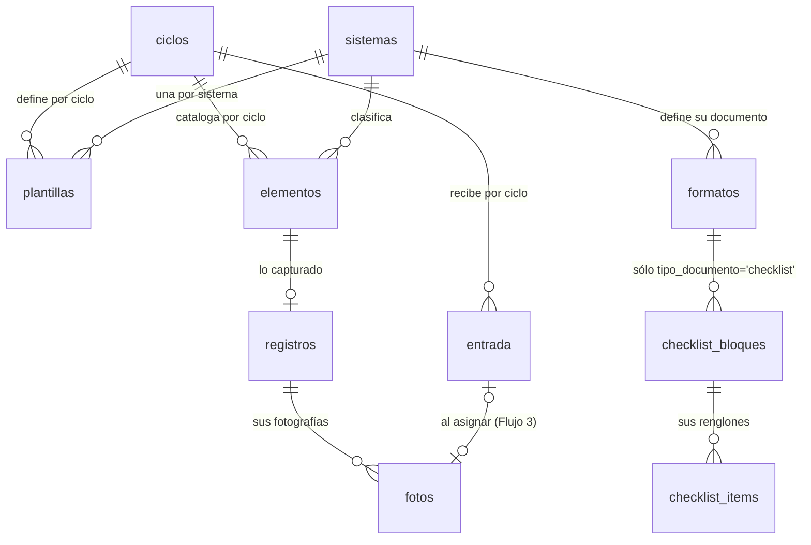

# Modelo de datos

Base de datos PostgreSQL alojada en Supabase. Las fotografías no se guardan en la base: viven en
Supabase Storage y la base conserva únicamente su ruta.

---

## 1. Panorama



Tres conjuntos con ciclos de vida distintos:

| Conjunto | Tablas | Quién lo modifica | Cuándo |
|---|---|---|---|
| **Configuración** | `ciclos`, `sistemas`, `formatos` | Encargado de sistemas | Al abrir el ciclo; `formatos` sólo cuando cambia el documento oficial, no cada mes |
| **Catálogo** | `elementos`, `plantillas` | Encargado de sistemas | Al abrir el ciclo y durante la ejecución |
| **Resultados** | `registros`, `fotos`, `entrada` | Quien captura | Durante la ejecución |
| **Checklist** | `checklist_bloques`, `checklist_items` | Encargado de sistemas | Al definir un tipo de checklist nuevo — no depende de ningún ciclo |

Todo cuelga de `ciclos`. Un ciclo es un mes de revisión; cerrar uno y abrir el siguiente no toca los
datos del anterior. `formatos` es la excepción: no cuelga de ningún ciclo — es la identidad y la
imagen de un RAG o de un checklist, estable entre meses (ver §2.8). `checklist_bloques`/
`checklist_items` tampoco cuelgan de ningún ciclo, por la misma razón: son el contenido fijo de un
tipo de documento, no algo que se capture mes a mes (ver §2.10, §2.11 y docs/decisiones.md D-22).

---

## 2. Diccionario de datos

### 2.1 `ciclos`

Un renglón por mes de revisión.

| Campo | Tipo | Nulo | Descripción |
|---|---|---|---|
| `id` | uuid | no | Llave primaria |
| `clave` | text | no | Identificador legible, formato `AAAA-MM`. Único. Ejemplo: `2026-08` |
| `nombre` | text | no | Etiqueta de presentación. Ejemplo: `Agosto 2026` |
| `mes` | smallint | no | 1 a 12 |
| `anio` | smallint | no | Año de cuatro dígitos |
| `estado` | text | no | `abierto` o `cerrado`. Sólo un ciclo puede estar abierto |
| `config` | jsonb | no | Parámetros del ciclo. Ver §3.1 |
| `creado` | timestamptz | no | Alta del ciclo |
| `cerrado` | timestamptz | sí | Fecha de cierre; nulo mientras esté abierto |

### 2.2 `sistemas`

Catálogo de los sistemas contra incendio que puede cubrir la revisión mensual — **no un conjunto
fijo de cinco**. Cada ciclo trae en `config.sistemas_activos` (§3.1) el subconjunto que le toca, y en
la práctica varía entre 2 y 10 según el mes; los cinco de la tabla de abajo son los valores con los
que arrancó el catálogo, no un techo. Un sistema nuevo se da de alta desde
**Configuración → Sistemas**, sin migración — el resto de la aplicación (captura, tablero, documento
RAG, e informe fotográfico) recorre lo que haya en esta tabla, no una lista cableada. El informe
fotográfico admite hasta 10 sistemas por corrida (`geo.AGENDA_MAX_SISTEMAS` en
`web/lib/informe/geometria.ts`) — el techo físico de casillas que trae su plantilla, no un límite de
esta tabla; ver docs/decisiones.md D-17.

| Campo | Tipo | Nulo | Descripción |
|---|---|---|---|
| `id` | uuid | no | Llave primaria |
| `clave` | text | no | Identificador técnico. Único. Ejemplo: `hidrantes_interiores` |
| `nombre` | text | no | Nombre operativo. Ejemplo: `Hidrantes interiores` |
| `rag` | text | sí | Formato asociado. Ejemplo: `RAG 2.3` |
| `orden` | smallint | no | Orden de presentación en la interfaz |
| `activo` | boolean | no | Permite ocultar un sistema sin borrarlo |
| `tipos` | jsonb | no | Diccionario de tipos del sistema: `[{clave, nombre}]`. Vacío = el sistema no distingue tipos y la columna Tipo del RAG no se dibuja. Ver §3.6 y docs/decisiones.md D-18 |

Valores iniciales:

| clave | nombre | rag | orden |
|---|---|---|---|
| `botones_avisadores` | Botones avisadores | RAG 2.4 | 1 |
| `hidrantes_interiores` | Hidrantes interiores | RAG 2.3 | 2 |
| `hidrantes_exteriores` | Hidrantes exteriores | RAG 2.2 | 3 |
| `valvulas_aereas` | Válvulas aéreas | RAG 2.7 | 4 |
| `valvulas_subterraneas` | Válvulas subterráneas | RAG 2.8 | 5 |

### 2.3 `plantillas`

Define **qué se supervisa** en un sistema durante un ciclo. Es la pieza que hace configurable el
formulario: cambia de un mes a otro sin tocar la aplicación.

| Campo | Tipo | Nulo | Descripción |
|---|---|---|---|
| `id` | uuid | no | Llave primaria |
| `ciclo_id` | uuid | no | Referencia a `ciclos` |
| `sistema_id` | uuid | no | Referencia a `sistemas` |
| `fotos` | jsonb | no | Momentos fotográficos requeridos. Ver §3.2 |
| `puntos` | jsonb | no | Puntos de revisión y su tipo de dato. Ver §3.2 |
| `texto_libre` | jsonb | no | Campos de descripción abierta habilitados |
| `actualizado` | timestamptz | no | Última modificación |

Restricción: única por `(ciclo_id, sistema_id)`.

### 2.4 `elementos`

Define **qué se revisa**. Es el catálogo del ciclo.

| Campo | Tipo | Nulo | Descripción |
|---|---|---|---|
| `id` | uuid | no | Llave primaria interna |
| `ciclo_id` | uuid | no | Referencia a `ciclos` |
| `sistema_id` | uuid | no | Referencia a `sistemas` |
| `codigo` | text | no | **Identificador único del elemento**, asignado por el área. Ejemplo: `AV-Z1-101` |
| `nombre` | text | no | Rótulo que lleva en campo. Ejemplo: `ELEM. 101` |
| `ubicacion` | text | sí | Coordenada o referencia física. Ejemplo: `A01-02` |
| `tipo` | text | sí | Clave del diccionario `sistemas.tipos` del elemento (p. ej. `G`), no el nombre completo. Ver docs/decisiones.md D-18 |
| `responsable` | text | sí | Persona asignada en el reparto del ciclo |
| `item_rag` | smallint | sí | Número de renglón en el formato RAG, para conciliar |
| `orden` | integer | no | Heredado de la extracción original; ya no decide el recorrido — ver `orden_anclado` y §3.6 |
| `activo` | boolean | no | Falso retira el elemento del ciclo sin borrar lo capturado |
| `notas` | text | sí | Observaciones del catálogo, no de la revisión |
| `referencia` | text | sí | Ayuda corta a la ubicación (≤5 palabras), para distinguir elementos próximos o similares. Columna opcional del documento RAG — ver `formatos.columnas` |
| `zona_id` | uuid | sí | Referencia a `zonas` (§2.9). Agrupador vigente del documento RAG y del informe fotográfico. `null` = todavía sin asignar |
| `orden_anclado` | smallint | sí | Cuando no es `null`, fija la posición del elemento dentro de su zona en vez de calcularla — ver §3.6 |
| `zona` | text | sí | **Sustituido por `zona_id`** (docs/decisiones.md D-18). Se conserva sin leerse |
| `seccion` | text | sí | **Sustituido por `zona_id`** (era el agrupador de D-15). Se conserva sin leerse |
| `orden_seccion` | smallint | sí | **Sustituido por `zonas.orden`**. Se conserva sin leerse |

Restricción: `codigo` único por `(ciclo_id, sistema_id, codigo)` — dentro de su sistema, no en todo
el ciclo.

> `zona`, `seccion` y `orden_seccion` quedaron en el esquema sin usarse a propósito: la cadena de
> migraciones de este repositorio no se puede reconstruir desde cero sobre una base limpia (ver
> docs/decisiones.md D-18), así que borrar columnas se dejó para una migración aparte, ya con los
> datos de `zona_id` verificados.

> **Por qué el identificador va separado del rótulo.** En los datos actuales el número rotulado no
> identifica al elemento: el RAG 2.4 repite `ELEM. 101` en las zonas 1, 2 y 3, y en las carpetas de
> marzo eso se resolvió agregando el nombre de quien revisó (`101 - Andres`, `101 - Jesus`,
> `101 - Julio`), lo que ata la identidad del activo a quién lo atendió ese mes. Con `codigo` propio
> el número deja de ser la llave y el rótulo puede repetirse sin ambigüedad.
>
> **Por qué la unicidad se limita al sistema.** Los formatos RAG reutilizan la misma nomenclatura
> para cosas distintas: `HC1-1` nombra un hidrante exterior en el RAG 2.2 y, por separado, la
> válvula de cierre de ese mismo hidrante en el RAG 2.8. Son dos elementos físicos distintos que
> coinciden en el nombre por convención de la propia instrucción, no un error de captura. Exigir
> unicidad en todo el ciclo rechazaría el segundo como duplicado del primero.

### 2.5 `registros`

Lo capturado para un elemento. Un renglón por elemento y ciclo.

| Campo | Tipo | Nulo | Descripción |
|---|---|---|---|
| `id` | uuid | no | Llave primaria |
| `elemento_id` | uuid | no | Referencia a `elementos`. Único |
| `como_se_encontro` | text | sí | Descripción del estado inicial |
| `que_se_realizo` | text | sí | Mantenimiento correctivo y limpieza aplicados |
| `pendientes` | text | sí | Lo que quedó abierto por falta de insumos o mantenimiento mayor. También alimenta la columna Observaciones del documento RAG — ver docs/decisiones.md D-15 §7.2; no hay una columna `observaciones` aparte |
| `valores` | jsonb | no | Respuestas a los puntos de la plantilla. Ver §3.3 |
| `estado` | text | no | `sin_iniciar`, `parcial` o `completo`. Derivado. Ver §4 |
| `capturado_por` | text | sí | Usuario que capturó |
| `creado` | timestamptz | no | Primera captura |
| `actualizado` | timestamptz | no | Última modificación |

### 2.6 `fotos`

| Campo | Tipo | Nulo | Descripción |
|---|---|---|---|
| `id` | uuid | no | Llave primaria |
| `registro_id` | uuid | no | Referencia a `registros` |
| `momento` | text | no | Identificador del bloque fotográfico de la plantilla: `antes`, `despues`, `estado` |
| `ruta` | text | no | Ruta del objeto en Storage. Única |
| `ancho` | integer | sí | Píxeles |
| `alto` | integer | sí | Píxeles |
| `bytes` | integer | sí | Tamaño del archivo |
| `orden` | smallint | no | Orden dentro del momento |
| `origen` | text | no | `captura` si se tomó en la aplicación, `recepcion` si llegó por WhatsApp |
| `subida` | timestamptz | no | Momento de la carga |

### 2.7 `entrada`

Área de espera para las fotografías que llegan sin clasificar.

| Campo | Tipo | Nulo | Descripción |
|---|---|---|---|
| `id` | uuid | no | Llave primaria |
| `ciclo_id` | uuid | no | Referencia a `ciclos` |
| `ruta` | text | no | Ruta temporal en Storage |
| `nombre_original` | text | sí | Nombre del archivo tal como llegó |
| `bytes` | integer | sí | Tamaño |
| `estado` | text | no | `pendiente`, `asignada` o `descartada` |
| `foto_id` | uuid | sí | Referencia a `fotos` una vez asignada |
| `subida` | timestamptz | no | Momento de la carga |

### 2.8 `formatos`

La identidad de un documento imprimible: lo que es **particular** de ese documento y no cambia entre
ciclos. No cuelga de `ciclos` — se identifica por `(nombre, periodicidad)`, no por mes. Lo que sí
cambia mes a mes —los puntos de revisión de un RAG— sigue viviendo en `plantillas` (§2.3); esa
separación es la que permitió que un tipo de documento nuevo (el checklist, §2.10) entrara después sin
tocar los cinco mensuales, tal como se previó. Ver docs/decisiones.md D-15, D-16 y D-22.

`tipo_documento` decide qué motor arma el documento a partir de esta fila: `'rag'` recorre un catálogo
de `elementos` con `web/lib/rag/` (columnas = puntos de una plantilla compartida, cierre único al
final); `'checklist'` arma sus propios bloques/ítems con `web/lib/checklist/` (§2.10, §2.11), sin
pasar por ningún catálogo ni por el flujo de captura fotográfica — se imprime en blanco para llenarse
a mano. Un formato `'checklist'` siempre trae `sistema_id = null`.

Lo que debe ser **idéntico** entre los dos motores —clasificación, razón social, domicilio, logo— vive
como constantes en `web/lib/documentos/constantes.ts`; lo que es propio de cada motor (la instrucción
general y el bloque de cierre de RAG; la instrucción general y el encabezado/cierre por columna del
checklist) vive en `web/lib/rag/constantes.ts` y `web/lib/checklist/constantes.ts` respectivamente —
así no hay manera de que un formato del mismo tipo lo traiga distinto a los demás (D-15 §7.1, D-22).
`armarDocumentoRAG()`/`armarDocumentoChecklist()` son quienes componen esas fuentes con la fila de
`formatos` al generar.

| Campo | Tipo | Nulo | Descripción |
|---|---|---|---|
| `id` | uuid | no | Llave primaria |
| `clave` | text | no | Identificador corto del documento oficial. Único. Ejemplo: `RAG 2.3`, `RAG 4.1` |
| `nombre` | text | no | Título completo del formato |
| `periodicidad` | text | no | `mensual` para los cinco RAG; `diario` para un checklist de unidad |
| `sistema_id` | uuid | sí | Referencia a `sistemas`. Nulo para formatos que no recorren un catálogo de elementos (por evento, o `tipo_documento='checklist'`) |
| `tipo_documento` | text | no | `'rag'` (default) o `'checklist'` — qué motor de renderizado le corresponde. Ver docs/decisiones.md D-22 |
| `documento_referencia` | text | no | Ejemplo: `I1.15M2_4037-002`, `I1.15M2_4037-004`. Va al **pie** del documento, no al encabezado |
| `revision` | text | sí | Va al pie, junto con `documento_referencia` |
| `instrucciones` | jsonb | no | Sólo las instrucciones **propias** de este formato (p. ej. "P = Pie, G = Gabinete" en RAG 2.2). La instrucción general no se repite aquí — se concatena al generar. Ver §3.4 |
| `notas` | text | sí | Discrepancias del documento de origen frente al proceso real, señaladas sin resolver — mismo criterio que `elementos.notas` |
| `columnas` | jsonb | no | `{ubicacion, referencia}` — qué columnas opcionales lleva un documento `'rag'`. Sin significado para `'checklist'`. Ver docs/decisiones.md D-19 |
| `creado` | timestamptz | no | Alta del formato |
| `actualizado` | timestamptz | no | Última modificación |

Restricciones: único por `(nombre, periodicidad)` y único por `clave`.

### 2.9 `zonas`

Catálogo único de la planta: no cuelga de `ciclos` ni de `sistemas`, para que un elemento de
hidrantes exteriores y uno de válvulas subterráneas puedan compartir zona cuando están co-ubicados.
Sustituye a `elementos.zona`/`seccion`/`orden_seccion` (D-15) — ver docs/decisiones.md D-18.

| Campo | Tipo | Nulo | Descripción |
|---|---|---|---|
| `id` | uuid | no | Llave primaria |
| `clave` | text | no | Identificador técnico. Único. Ejemplo: `calle-1-seccionamiento` |
| `nombre` | text | no | Forma corta — lo que imprime el documento RAG en su columna de zona. Ejemplo: `Calle 1 · Seccionamiento` |
| `descripcion` | text | sí | Contexto adicional, sólo para pantalla — no se imprime |
| `orden` | smallint | no | Orden de presentación entre zonas. Sustituye a `elementos.orden_seccion` |
| `activo` | boolean | no | Permite retirar una zona sin borrarla |

### 2.10 `checklist_bloques`

Un bloque de un formato `tipo_documento='checklist'` — portada de fotos de identificación, tabla de
equipo con verificaciones, sub-checklist de descripciones simples (mecánico), o bitácora de columnas
libres sin fechas. Ver docs/decisiones.md D-22.

| Campo | Tipo | Nulo | Descripción |
|---|---|---|---|
| `id` | uuid | no | Llave primaria |
| `formato_id` | uuid | no | Referencia a `formatos`, `on delete cascade` |
| `tipo` | text | no | `portada_fotos`, `tabla_verificacion`, `tabla_simple` o `bitacora_libre` — decide cómo se interpretan sus `checklist_items` (§2.11) y cómo se renderiza (`web/lib/checklist/render.ts`) |
| `nombre` | text | no | Título del bloque, p. ej. `Equipo`, `Mecánico`, `Bitácora de insumos` |
| `orden` | smallint | no | Orden de aparición dentro del documento |
| `columnas` | jsonb | no | Sólo `bitacora_libre`: `[{id, etiqueta}]` de sus columnas fijas. Vacío en los demás tipos |
| `filas_blanco` | smallint | sí | Sólo `bitacora_libre`: cuántas filas en blanco imprimir. Nulo en los demás tipos |
| `creado` | timestamptz | no | Alta del bloque |
| `actualizado` | timestamptz | no | Última modificación |

### 2.11 `checklist_items`

Un renglón de un `checklist_bloques` — un "Equipo" con su foto de referencia y una o más
verificaciones, o una "Descripción" del sub-checklist mecánico.

| Campo | Tipo | Nulo | Descripción |
|---|---|---|---|
| `id` | uuid | no | Llave primaria |
| `bloque_id` | uuid | no | Referencia a `checklist_bloques`, `on delete cascade` |
| `categoria` | text | sí | Agrupador visual dentro del bloque (p. ej. `EQUIPO MEDICO`), texto libre — **no** referencia a `zonas`: las categorías de un checklist son propias de ese checklist, no necesitan el catálogo compartido de planta (ver docs/decisiones.md D-22) |
| `pos` | text | sí | Rótulo tal cual el documento de origen. Puede repetirse — el PDF de la ambulancia trae Pos duplicados reales (`63` se repite 6 veces); no es una clave, sólo se imprime |
| `nombre` | text | no | "Equipo" (bloques de tabla) o "Descripción" (sub-checklist mecánico) |
| `cantidad` | text | sí | Texto libre, p. ej. `6`, `1 C/U`, `2 pares` — no siempre es un número entero simple |
| `foto_referencia_ruta` | text | sí | Ruta en el depósito `evidencias`, prefijo `checklist-ref/` — mismo depósito que las fotos de campo, sin bucket nuevo |
| `verificaciones` | jsonb | no | `[{id, etiqueta}]` — vacío en bloques `tabla_simple`. Cada verificación se imprime como su propio renglón, con Pos/Equipo/Cantidad/Foto compartidos por `rowspan` (ver `web/lib/checklist/render.ts`) |
| `orden` | smallint | no | Único campo que decide el renderizado — mismo patrón que `elementos.codigo` (identidad) contra `elementos.orden` (render) |
| `notas` | text | sí | Ambigüedades del documento de origen sin resolver — mismo criterio que `elementos.notas`/`formatos.notas` |

No hay tabla de "capturas" para un checklist: se imprime en blanco y punto, sin equivalente a
`registros`/`valores`. Las columnas de fecha del documento tampoco se guardan — se derivan de los días
del mes del ciclo abierto al generar (`new Date(anio, mes, 0).getDate()`, 31 de respaldo si no hay
ciclo); las celdas quedan en blanco para llenarse a mano.

---

## 3. Estructuras JSON

### 3.1 `ciclos.config`

```jsonc
{
  "sistemas_activos": ["botones_avisadores", "hidrantes_interiores"],
  "captura_directa":  ["botones_avisadores", "hidrantes_interiores"],
  "imagen": { "lado_max": 2560, "calidad": 88, "formato": "jpeg" },
  "fechas": { "ejecucion_inicio": "2026-08-01", "ejecucion_fin": "2026-08-19",
              "entrega": "2026-08-20", "supervision_fin": "2026-08-30" }
}
```

`sistemas_activos` determina qué se muestra; `captura_directa` distingue los sistemas que se capturan
en la aplicación de los que llegan por recepción, y es lo que separa los dos tableros.

### 3.2 `plantillas`

Ejemplo para hidrantes interiores en el ciclo 2026-08:

```jsonc
{
  "fotos": [
    { "id": "antes",   "etiqueta": "Antes",   "requerido": true, "min": 1 },
    { "id": "despues", "etiqueta": "Después", "requerido": true, "min": 1 }
  ],
  "puntos": [
    { "id": "valvula_aerea_abierta", "etiqueta": "Válvula aérea abierta",           "tipo": "si_no", "requerido": true },
    { "id": "gabinete_buen_estado",  "etiqueta": "Gabinete en buen estado",         "tipo": "si_no", "requerido": true },
    { "id": "manguera_piton",        "etiqueta": "Manguera y pitón en buen estado", "tipo": "si_no", "requerido": true },
    { "id": "pintura",               "etiqueta": "Pintura",                         "tipo": "si_no", "requerido": true }
  ],
  "texto_libre": ["como_se_encontro", "que_se_realizo", "pendientes"]
}
```

`Observaciones` ya no es un punto de la plantilla: es columna fija del documento RAG en los cinco
formatos (ver §2.8 y docs/decisiones.md D-15), así que no se declara aquí.

Tipos admitidos en `puntos`:

| Tipo | Captura | Valor almacenado |
|---|---|---|
| `si_no` | Dos botones | `true` (SI) / `false` (NO) |
| `si_no_na` | Tres botones | `true` (SI) / `false` (NO) / `null` (NA) |
| `texto` | Campo de texto | Cadena |
| `numero` | Campo numérico | Número |
| `seleccion` | Lista; requiere `opciones` | Cadena de la lista |
| `fecha` | Selector de fecha | `AAAA-MM-DD` |

Las válvulas aéreas, que sólo llevan inspección visual, se expresan cambiando el bloque `fotos` sin
tocar código:

```jsonc
{
  "fotos": [ { "id": "estado", "etiqueta": "Estado actual", "requerido": true, "min": 1 } ],
  "texto_libre": ["como_se_encontro", "pendientes"]
}
```

### 3.3 `registros.valores`

Objeto plano cuyas llaves son los `id` de los puntos de la plantilla vigente. Los puntos `si_no` y
`si_no_na` se guardan como **booleano** (o `null` para NA), no como texto — separar el dato de su
presentación es lo que permite contar, promediar y comparar puntos entre formatos sin normalizar
cadenas primero (ver docs/decisiones.md D-15).

```jsonc
{
  "valvula_aerea_abierta": true,
  "gabinete_buen_estado":  false,
  "manguera_piton":        true,
  "pintura":               true
}
```

**`false` no es "sin contestar".** Es una respuesta válida (NO) y debe distinguirse de la llave
ausente, que sí significa que el punto no se contestó. `calcularEstado()` (§4) comprueba **presencia
de la llave**, nunca la veracidad del valor — si comprobara veracidad, un elemento con todos sus
puntos en NO se quedaría en `parcial` para siempre.

Si un punto desaparece de la plantilla, su valor permanece almacenado pero deja de mostrarse y de
contar para el estado. No se borra: es información capturada en campo.

### 3.4 El encabezado y el cierre del documento: global + particular

`DocumentoRAG.encabezado` y `.cierre` (lo que de verdad consume `render.ts`) se arman en
`armarDocumentoRAG()` mezclando dos fuentes — ver docs/decisiones.md D-15 §7.1:

```jsonc
// Global — web/lib/rag/constantes.ts, igual en los cinco formatos mensuales.
// No hay manera de que un formato lo traiga distinto: no es un dato, es código.
{
  "CLASIFICACION": "INTERNAL",
  "RAZON_SOCIAL": "Volkswagen de México S.A. de C.V.",
  "DOMICILIO": ["Calle Mineral de Valenciana 611, Puerto Interior", "Silao Guanajuato, México."],
  "INSTRUCCION_GENERAL": "Marque SI o NO en cada punto de revisión según el estado del elemento. ...",
  "CIERRE_ESTANDAR": {
    "repetir": true,
    "campos": [
      { "id": "realizo",      "etiqueta": "Realizó (nombre, grupo y firma)",              "tipo": "firma" },
      { "id": "fecha",        "etiqueta": "Fecha",                                        "tipo": "fecha" },
      { "id": "coordinador",  "etiqueta": "Coordinador de Soporte de PCI (nombre y firma)", "tipo": "firma" }
    ]
  }
}

// Particular — fila de `formatos` (§2.8), distinto por documento.
{
  "documento_referencia": "I1.15M2_4037-002",
  "revision": "5",
  "instrucciones": ["Tipo de hidrante: P = Pie, G = Gabinete."]
}
```

`documento_referencia` y `revision` van al **pie** del documento, no al encabezado — como en los RAG
de origen. Las `instrucciones` particulares se concatenan **después** de `INSTRUCCION_GENERAL` al
generar. `cierre.repetir` decide si el bloque de firmas aparece en cada página del documento o sólo al
final del documento completo; siendo global hoy siempre es `true`, pero queda como campo —no una
constante suelta— para que un formato de otra periodicidad lo pueda resolver distinto más adelante sin
tocar los mensuales.

### 3.5 Formatos de intercambio de Configuración → Importar y exportar

Cuatro formatos JSON distintos conviven en ese panel (`web/app/(app)/configuracion/PanelImportarExportar.tsx`),
con dos niveles de madurez: catálogo y formatos RAG tienen ida y vuelta completa (importar concilia,
no sólo sobrescribe); zonas y sistemas sólo tienen botón de exportar — la copia sirve de respaldo o
para editar en pantalla, no hay importador que los concilie todavía.

#### 3.5.1 Catálogo (elementos)

```jsonc
{
  "ciclo": "2026-08",
  "elementos": [
    {
      "codigo": "AV-Z1-101",
      "sistema": "botones_avisadores",
      "nombre": "ELEM. 101",
      "zona": "Zona 1 · Nave producción",
      "ubicacion": "G01-02",
      "referencia": "Planta alta",
      "seccion": "Zona 1 · Nave producción",
      "orden_seccion": 1,
      "tipo": "HMS-D",
      "responsable": "Benjamín",
      "item_rag": 1,
      "orden": 1,
      "activo": true
    }
  ]
}
```

La importación concilia por `(sistema, codigo)`: lo que existe se actualiza, lo que no existe se da
de alta, y lo que ya no aparece en el archivo se marca `activo = false` en lugar de borrarse.

> Este formato de intercambio todavía usa `zona`/`seccion`/`orden_seccion`, no `zona_id`/`tipo`-como-
> clave. La pantalla de edición (`/sistemas/[clave]`) ya usa los campos de §2.9 y §3.6 — sólo el JSON
> de importar/exportar (`/configuracion → Importar y exportar`) se quedó en la forma vieja, a
> propósito: rediseñar el formato de intercambio quedó fuera de la reorganización de pantallas. Ver
> docs/decisiones.md D-18 y D-21.

#### 3.5.2 Plantillas (puntos de revisión por sistema)

Sólo **exportación** — botón "Exportar plantillas" del mismo panel. No existe importador: cambiar
puntos de revisión se hace desde `/sistemas/[clave]` (Flujo 6), donde el sistema advierte cuántos
elementos cambian de estado antes de confirmar; un importador que sobrescribiera `plantillas` sin ese
aviso podría regresar elementos ya capturados a `parcial` sin que nadie se dé cuenta.

```jsonc
{
  "ciclo": "2026-08",
  "plantillas": [
    { "sistema": "hidrantes_interiores", "fotos": [ /* §3.2 */ ], "puntos": [ /* §3.2 */ ], "texto_libre": ["como_se_encontro", "que_se_realizo", "pendientes"] }
  ]
}
```

Un renglón por sistema que tenga plantilla capturada en el ciclo — los que aún no la tienen no
aparecen.

#### 3.5.3 Formatos RAG (identidad del documento)

Importación **y** exportación, aunque el panel sólo trae botón de importar — no hay "Exportar
formatos" en pantalla todavía. Alimenta la tabla `formatos` (§2.8), no `plantillas`: aquí sólo va lo
que es fijo por documento (clave, referencia, instrucciones propias), nunca los puntos de revisión del
mes.

```jsonc
{
  "formatos": [
    {
      "clave": "RAG 2.3",
      "nombre": "Formato de revisión de hidrantes interiores",
      "periodicidad": "mensual",
      "sistema": "hidrantes_interiores",
      "documento_referencia": "I1.15M2_4037-002",
      "revision": "5",
      "instrucciones": ["Tipo de hidrante: P = Pie, G = Gabinete."],
      "notas": null
    }
  ]
}
```

La conciliación es por `clave` (`upsert`, `onConflict: "clave"`): lo que existe se actualiza, lo que
no existe se da de alta. Un `sistema` que no exista en la tabla `sistemas` no rechaza el renglón —lo
carga con `sistema_id = null` y lo señala como advertencia—, porque `formatos.sistema_id` admite nulo
para documentos que no recorren un catálogo de elementos (§2.8).

#### 3.5.4 Zonas y sistemas

Sólo exportación — copia de respaldo de las dos tablas de catálogo compartido, tal como las devuelve
`obtenerZonas()`/`obtenerSistemasCatalogo()` (renglón completo, sin transformar):

```jsonc
// zonas.json
[{ "id": "...", "clave": "calle-1-seccionamiento", "nombre": "Calle 1 · Seccionamiento", "descripcion": null, "orden": 1, "activo": true }]

// sistemas.json
[{ "id": "...", "clave": "hidrantes_interiores", "nombre": "Hidrantes interiores", "rag": "RAG 2.3", "orden": 2, "activo": true, "tipos": [] }]
```

Ambas se editan desde la pantalla (**Configuración → Zonas** y **→ Sistemas**), altas incluidas — este
JSON es sólo para tener una copia fuera de la base, no un formato de importación.

### 3.6 El orden de recorrido

No es un campo, es una regla — `web/lib/orden.ts` (ver docs/decisiones.md D-20). Dentro de una zona:

1. Los elementos con `orden_anclado` no nulo van primero, ordenados entre ellos por ese valor.
2. El resto se ordena por `ubicacion` (alfabético natural — `H-2` antes que `H-10`) y, en empate o si
   falta, por `nombre`.

Las zonas entre sí se ordenan por `zonas.orden`; una zona sin `orden` conocido (o "Sin zona", para un
elemento con `zona_id` nulo) va al final, alfabética. La misma función ordena el documento RAG
(dentro de cada sección) y el informe fotográfico — así un elemento aparece en el mismo lugar
relativo en los dos.

### 3.7 El encabezado y el cierre del checklist: por columna, no al final

A diferencia de §3.4 (`CIERRE_ESTANDAR` de RAG: un único bloque de firmas al final del documento), el
checklist repite Fecha+Grupo en el encabezado y Nombre+Firma en el pie **de cada columna de fecha**,
porque cada columna es una revisión distinta hecha por alguien distinto ese día — ver
docs/decisiones.md D-22.

```jsonc
// web/lib/checklist/constantes.ts — igual en todos los checklist, no vive en 'formatos'
{
  "ENCABEZADO_COLUMNA_CHECKLIST": { "fecha": "Fecha", "grupo": "Grupo" },
  "CIERRE_COLUMNA_CHECKLIST": { "nombre": "Nombre", "firma": "Firma" }
}
```

Como puede haber hasta 31 columnas de fecha —más de las que caben en una hoja Carta apaisada—, un
mismo bloque de tabla (`checklist_bloques` de tipo `tabla_verificacion` o `tabla_simple`) se reparte en
varias `<table>` independientes, cada una con su propio encabezado/cierre completo repetidos y salto de
página entre ellas (`web/lib/checklist/columnas.ts` función `rebanarColumnasFecha()`). La sección
general de AÑO/MES (pedida explícitamente para identificar el mes de uso del documento impreso) sí es
única por tabla, no por columna, y sus casillas quedan en blanco para llenarse a mano — igual que las
celdas de Fecha/Grupo/Nombre/Firma: el checklist nunca trae un modo "lleno", siempre se imprime vacío.

---

## 4. Derivación del estado

`registros.estado` no se captura: se calcula contra la plantilla vigente del sistema cada vez que se
guarda, y se recalcula para todo el sistema cuando la plantilla cambia.

```
completo   ⟺  para cada bloque de fotos con requerido = true:
                  número de fotos con ese momento ≥ min
              Y para cada campo en texto_libre:
                  el texto no está vacío
              Y para cada punto con requerido = true:
                  si tipo ∈ {si_no, si_no_na}: la llave punto.id existe en valores
                    (false / NO cuenta como contestado; sólo la ausencia de la llave falta)
                  si no: valores[punto.id] existe y no está vacío

sin_iniciar ⟺  no hay renglón en registros,
              o el renglón no tiene fotos ni textos ni valores

parcial     ⟺  cualquier otro caso
```

Consecuencia a tener presente: agregar un punto obligatorio a media ejecución regresa a `parcial` los
elementos ya capturados que no lo tengan contestado. Es el comportamiento correcto —el dato falta de
verdad— pero la aplicación lo advierte antes de guardar el cambio de plantilla.

---

## 5. Almacenamiento de archivos

Depósito privado `evidencias`. Ningún objeto es público: sólo se lee o se escribe con una sesión
autenticada, exigida por las políticas de `0004_storage.sql`. El navegador sube cada fotografía
directo al depósito con esa sesión, sin pasar por el servidor de la aplicación (ver
docs/decisiones.md D-06).

| Contenido | Ruta |
|---|---|
| Fotografía asignada | `{ciclo}/{sistema}/{codigo}/{momento}_{NN}.jpg` |
| Fotografía sin clasificar | `{ciclo}/_entrada/{uuid}.jpg` |
| Plantilla corporativa del informe | `_plantillas/Reporte sistemas - MASTER.pptx` |
| Informe fotográfico generado | `{ciclo}/_informe/Informe_Reporte_{cicloNombre}.pptx` |

Ejemplo: `2026-08/hidrantes_interiores/HI-024/antes_01.jpg`

La plantilla no depende de ningún ciclo — vive fuera de cualquier prefijo `{ciclo}`, igual que
`_entrada` vive dentro de uno. Se sube una sola vez con `subir-plantilla-informe.ts` (ver
docs/decisiones.md D-17).

Las imágenes se reducen en el navegador antes de subirse: lado mayor 2560 px, JPEG calidad 88, con
la orientación EXIF ya aplicada al píxel. Una fotografía de teléfono pasa de unos 4 MB a entre 800 KB
y 1.2 MB, resolución suficiente para servir como evidencia posterior y no sólo para el informe.

Volumen estimado: 221 elementos × 2 fotografías × 1 MB ≈ 440 MB por ciclo.

---

## 6. Índices y restricciones

| Objeto | Definición | Motivo |
|---|---|---|
| `ciclos.clave` | único | Un ciclo por mes |
| Único parcial sobre `ciclos.estado` | sólo un `abierto` | Evita ambigüedad sobre el ciclo vigente |
| `sistemas.clave` | único | Referencia estable desde configuración y plantillas |
| `plantillas (ciclo_id, sistema_id)` | único | Una plantilla por sistema y ciclo |
| `elementos (ciclo_id, sistema_id, codigo)` | único | Identificador único dentro de su sistema |
| `elementos (ciclo_id, sistema_id, orden)` | índice | Consulta por sistema; el orden de recorrido real lo calcula §3.6, no esta columna |
| `zonas.clave` | único | Referencia estable desde importación de catálogo |
| `elementos.zona_id` | referencia a `zonas`, `on delete restrict` | No se puede borrar una zona con elementos asignados |
| `registros.elemento_id` | único | Un registro por elemento |
| `registros (estado)` | índice | Consultas del tablero |
| `fotos (registro_id, momento, orden)` | índice | Armado del formulario y del collage |
| `fotos.ruta` | único | Evita duplicar objetos |
| `entrada (ciclo_id, estado)` | índice | Rejilla de pendientes por clasificar |

Borrados en cascada: al eliminar un `registro` se eliminan sus `fotos`; los objetos de Storage se
retiran en la misma operación. Los `elementos` no se borran, se desactivan.

---

## 7. Control de acceso

Row Level Security activo en todas las tablas. En el ciclo piloto opera un solo usuario y las
políticas se limitan a exigir sesión autenticada para leer y escribir. El campo `responsable` en
`elementos` y `capturado_por` en `registros` ya permiten, sin migración, restringir después a cada
especialista los elementos que le corresponden.

El depósito de Storage no admite acceso anónimo ni en lectura ni en escritura: `0004_storage.sql`
exige sesión autenticada para las cuatro operaciones (leer, subir, actualizar, borrar). La subida y
el movimiento de objetos (al asignar una entrada, ver Flujo 3) se hacen directo con esa sesión, sin
URL firmada — ver D-06 para por qué se descartó esa alternativa. La lectura de fotografías ya
asignadas sí usa URL firmada de vigencia corta (una hora), generada por el servidor al construir la
pantalla, porque ahí sí conviene no exponer la sesión completa sólo para mostrar una miniatura.
